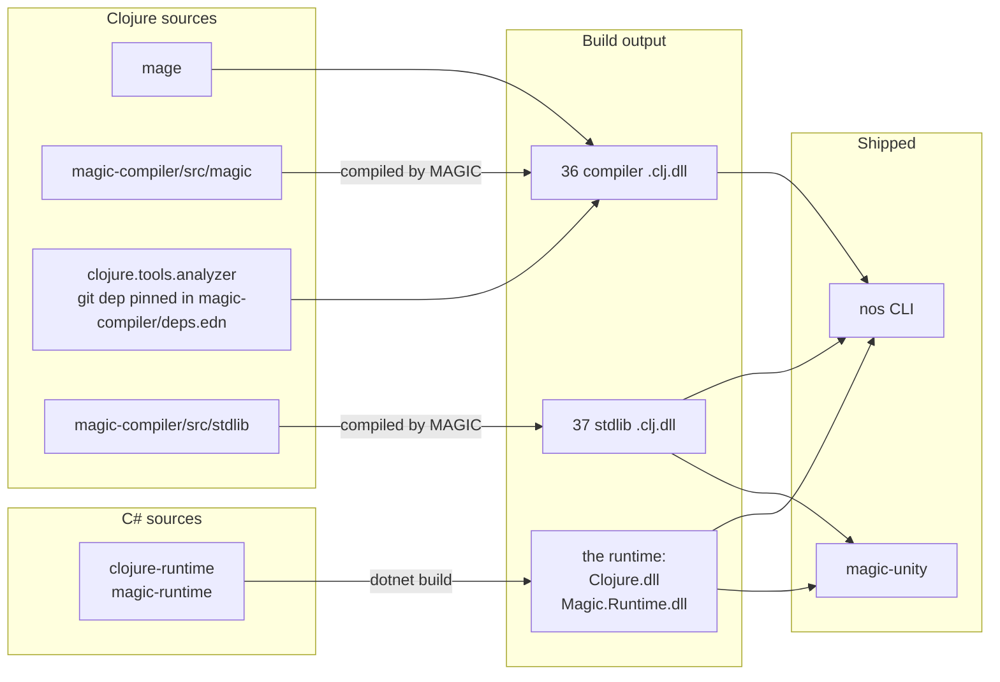
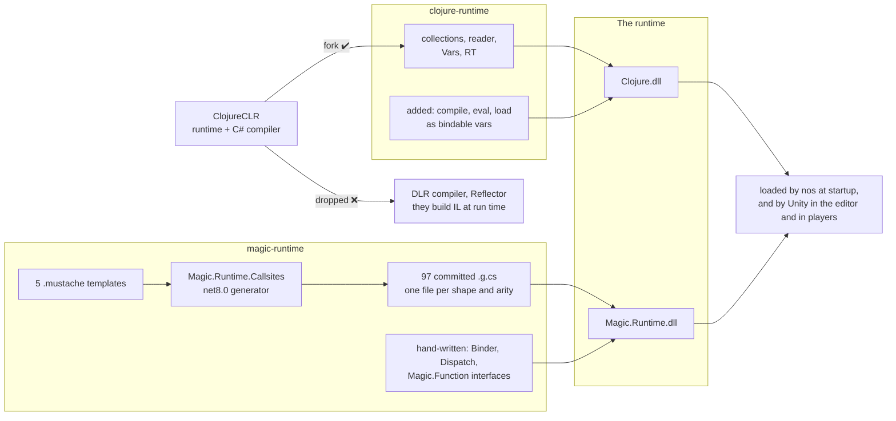
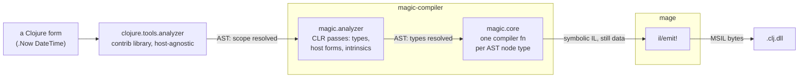
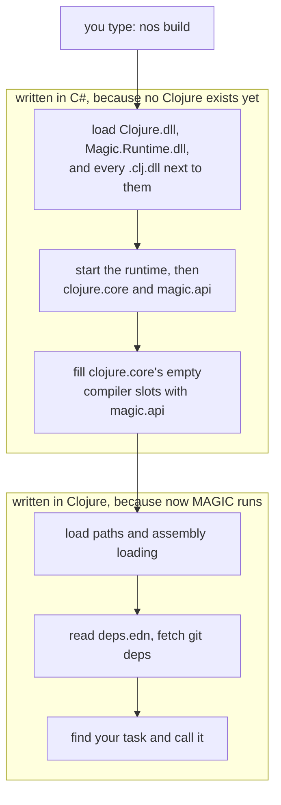
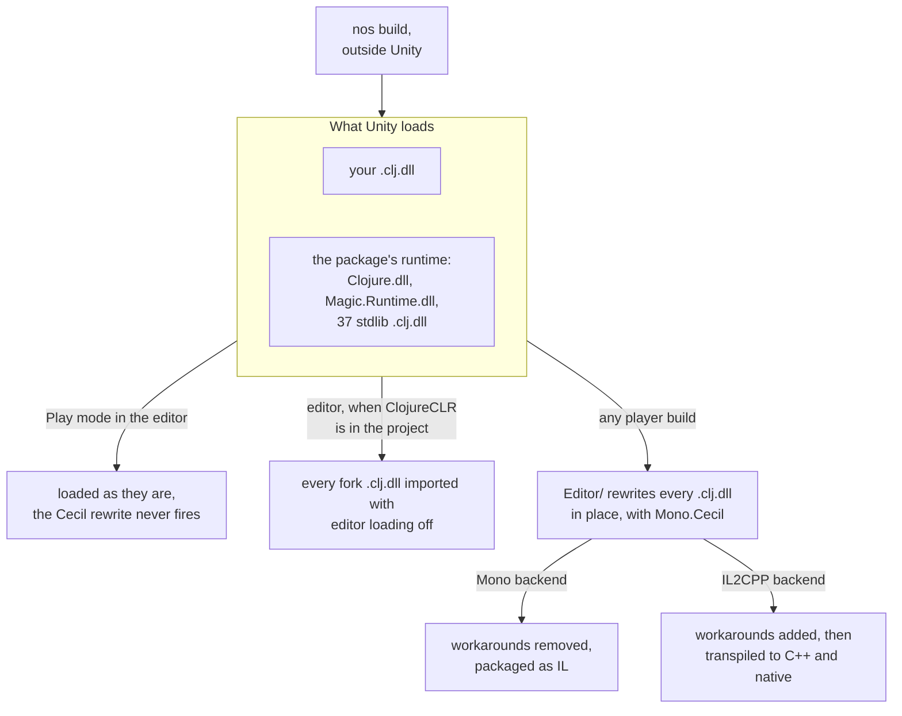

# MAGIC architecture

Magic is a monorepo for the compiler and its tooling.

## Components Overview

| Component | Description | Language |
|-----------|-------------|----------|
| [clojure-runtime](../clojure-runtime) | Clojure's data model in C#: persistent collections, keywords, vars, the reader. Every compiled DLL runs on it. | C# |
| [magic-runtime](../magic-runtime) | Resolves the interop calls whose types are only known at run time, caching each call site. Emits no IL at run time, which is what IL2CPP requires. | C# |
| [mage](../mage) | MSIL as Clojure data, so bytecode can be built and rewritten as plain values before it is emitted. | Clojure |
| [magic-compiler](../magic-compiler) | The compiler: Clojure forms to MSIL. Also holds the standard library sources it compiles. | Clojure |
| [nostrand](../nostrand) | The `nos` CLI. Boots the runtime, loads the compiler DLLs, resolves dependencies, runs build, test and REPL tasks. | C# + Clojure |
| [magic-unity](../magic-unity) | The UPM package Unity loads at play time: the prebuilt runtime plus the IL2CPP pre-build step. | C# |
| [magic-unity-smoke](../unity-examples/magic-unity-smoke) | Unity project that runs the same checks under Mono and under IL2CPP, catching the AOT-only bugs Mono cannot reach. Run by hand on Unity `2022.3.62f3`. | Clojure + C# |
| [magic-unity-coexist](../unity-examples/magic-unity-coexist) | Unity project that runs MAGIC and ClojureCLR side by side, MAGIC for players and ClojureCLR for editor hot reload. | C# |

The diagram below shows what gets built from what, and what ships.

Consumers only need 2 things:
 - a `nos` CLI that developers install
 - a Unity package which a game loads at play time

## The runtime

Compiled Clojure cannot run on its own.

Something has to hold the collections, intern the keywords, resolve the vars, and handle the calls the compiler could not resolve ahead of time. That is the runtime, and it ships as two DLLs.

The diagram below shows where each piece comes from, and what was left behind on the way.

ClojureCLR already had a runtime, and rewriting it would have been a waste of time, so Ramsey Nasser forked it. What the fork could not keep was the compiler that comes with it.

Upstream ClojureCLR writes IL while the program runs. Each form becomes an expression tree, and the tree goes to `Reflection.Emit`, which turns it into runnable code on the spot. Interop works the same way. The first time a call site runs, the [DLR](https://learn.microsoft.com/en-us/dotnet/framework/reflection-and-codedom/dynamic-language-runtime-overview) compiles a delegate specialized to the argument types it just saw, guards it with a type check, and caches it on the site.

So the compiler ships with the program, and the writing happens wherever the program runs. On a desktop that is a good trade. On iOS it is illegal, because a memory page may never be writable and executable at once. Under IL2CPP it is not even available, because an AOT toolchain only translates the IL that exists at build time and ships no `Reflection.Emit` to produce more. That constraint is why MAGIC exists, see [Why MAGIC](./why-magic.md).

The fork therefore keeps everything that holds values and drops everything that writes code. `CljCompiler/` goes from 72 files upstream down to 3, and most of what went is one directory: `Ast/`, the 65 expression-tree node classes. `Reflector`, the class behind runtime reflective calls, is gone. The `DynamicLanguageRuntime` package reference went with them, and that is the part that makes the result shippable, because no `Reflection.Emit` path survives in `Clojure.dll`. One expression-tree call remains, `GenDelegate.Create` behind `gen-delegate`. It survives because expression trees fall back to an interpreter on AOT platforms.

`clojure.core` calls into the compiler at four entry points: `eval`, `macroexpand-1`, and RT's load and compile paths. The fork turns each one into a dynamic var that throws until bound (`*eval-form-fn*`, `*macroexpand-1-fn*`, `*load-file-fn*`, `*compile-file-fn*`). `nostrand` fills the gap at startup by binding them to `magic.api`, and MAGIC becomes the compiler without `clojure.core` knowing whose compiler it is.

Dispatch needs a replacement too, and that is `magic-runtime`. Rather than compiling a delegate per call site, every call site shape exists ahead of time as a generated type, and each site caches the argument types it has already seen. Same idea as the DLR's inline caches, minus the code generation.

The two DLLs are inseparable in practice. `nos` loads them at startup, Unity loads them at play time, and every compiled `.clj.dll` names both in its assembly references. That is why the diagram shows them as one box.

## The compiler

The compiler turns a Clojure form into MSIL, and it does that in three steps.

The reader hands over data with no meaning attached. `(let [x 1] (+ x 2))` is a list holding a symbol, a vector and another list. Nothing in it says the `x` in the body is the `x` in the brackets. So the steps are as follows:
1. works out what the form means
2. works out which CLR types are involved
3. writes the instructions.

The analyzer resolves that list into a tree where every node is labelled: `let*` is a special form, `x` is a local, the body's `x` points back at its binding. None of that depends on the host, so it comes from `clojure.tools.analyzer`, the contrib library every Clojure implementation can share. What the library will not do is CLR work: whether `DateTime` names a type, which overload of `.Add` applies, what type an expression produces. Those passes are `magic.analyzer`. They turn a host-agnostic tree into one a CLR backend can use.

That split is not MAGIC's invention. Contrib had already laid it out, and MAGIC fills in the CLR column:

| Job | JVM | MAGIC |
|---|---|---|
| host-agnostic analysis | `tools.analyzer` | `tools.analyzer`, the same library |
| host-specific passes | `tools.analyzer.jvm` | `magic.analyzer` |
| AST to bytecode | `tools.emitter.jvm` | `magic.core` + `mage` |

`tools.analyzer.jvm` and `tools.emitter.jvm` together are a Clojure compiler written in Clojure. MAGIC is that idea aimed at the CLR, which is why it depends on the first row instead of reimplementing it.

Once the tree knows its types, each node needs instructions. `magic.core` holds one function per node type, keyed by the `:op` the analyzer produced, and in MAGIC's vocabulary those functions are the compilers. They are small: the whole compiler for a static property is `(il/call (.GetGetMethod property))`. Each one is handed the map of all compilers and passes it down, so compiling a `do` form is just compiling its children. Spells work at this level too. A spell is a function from the compiler map to a new compiler map, so turning one on swaps in a specialized compiler for certain nodes and leaves the rest alone.

A CLR compiler normally emits by calling `ilg.Emit(OpCodes.Ldstr, "hi")`, and the instruction exists only as a side effect: you cannot hold it, inspect it, or change your mind about it. `mage` makes the same instruction a value. `(il/ldstr "hi")` returns a map, a tree of those maps describes an assembly, and `il/emit!` is the one function that walks the tree and produces bytes. Ramsey calls this symbolic bytecode. It is what lets the compilers return instructions instead of performing them, which is why one can be called in a REPL and read, and why `bb pipeline` can show the IL for a form without running it.

`mage` is built on `System.Reflection.Emit`, the API IL2CPP does not implement. That is not a contradiction. `mage` runs on a developer's machine at build time, under Mono, and never ships in the Unity package. Only the `.clj.dll` it wrote travels to the device, and nothing in that file emits anything. The difference between MAGIC and ClojureCLR is not which API each uses, it is when each runs it.

## Nostrand

Everything so far is unusable on its own.

The compiler is itself compiled Clojure, so something has to load it before any Clojure can run. `clojure.core` ships with its compiler slots empty, so something has to fill them. The CLR has no `clojure` CLI and no dependency resolution either. `nostrand` answers all of that. It is `NostrandMain.exe`, and it is what `nos` runs.

It is written in two languages, and where the line between them falls is the whole story. Everything that has to happen before Clojure works is C#. Everything after it is Clojure.

The C# half is `Nostrand.cs`. It loads every `.clj.dll` sitting next to `Clojure.dll`, starts the runtime, initialises `clojure.core` and `magic.api`, then fills the compiler slots. Four of them, `*compile-file-fn*`, `*load-file-fn*`, `*eval-form-fn*` and `*macroexpand-1-fn*`, are pointed at `magic.api`. The fifth, `*load-fn*`, is pointed back into `clojure.core`. After those five lines `compile`, `eval` and `load-file` work, and nothing that calls them knows which compiler answered.

The Clojure half is under `nostrand/`. It puts source paths on the load path, reads `deps-clr.edn`/`deps.edn` and fetches git dependencies, defines the tasks, and hosts the REPLs. None of it could have run a moment earlier. [CLR dependency resolution](./clr-dependency-files.md) and [the nos CLI](./nos-cli.md) cover what it does.

The output directory makes this concrete. `nostrand/bin/Release/net471/` holds `NostrandMain.exe`, `Clojure.dll` and `Magic.Runtime.dll`, and then two kinds of Clojure side by side: 73 compiled `.clj.dll`, and nostrand's own Clojure (`core.clj`, `tasks.clj`, `repl.clj`, the deps code) as plain source.

They differ because three separate compilations happen, at three different times.

| What is compiled | When | Where the result goes |
|---|---|---|
| the compiler and the stdlib | rarely, during a bootstrap | `nostrand/references/`, committed to git |
| nostrand's own `.clj` | every `nos` startup | memory only, gone when the process exits |
| your project | when you run `nos build` | `.clj.dll` next to your sources |

The compiler is a DLL out of necessity: it cannot compile itself into existence, so [the bootstrap](./bootstrap.md) builds it rarely and the result is committed, which is why `references/` is in git. Nostrand's Clojure has no such constraint, because by the time it loads MAGIC is already running, and source is the cheaper form: a committed DLL would need a refresh after every task edit and every compiler change, while a fresh in-memory compile of a thousand lines is fast and can never be stale.

## The Unity package

Unity never compiles Clojure.

You compile first with `nos`, which writes `.clj.dll` into `Assets/Plugins/Magic/`, and Unity loads them as ordinary .NET assemblies. So the package ships a runtime and no compiler.

The two backends in the diagram are Unity's scripting backend setting, chosen per build target. Mono ships the IL to the device and JIT-compiles it there. IL2CPP translates all the IL to C++ at build time and compiles that to a native binary, which is why nothing may be emitted at run time.

The runtime side is small. `Runtime/Magic.Unity.cs` is the `Magic.Unity.Clojure` API that C# scripts call, `Boot`, `Require` and `GetVar`, and `Runtime/magic/` holds the prebuilt runtime plus the whole stdlib. In Play mode no build callback fires, and the assemblies load and run as they are.

The editor side, nine files, mostly exists because IL2CPP rejects IL that MAGIC emits legally. `Editor/MagicPreprocessor.cs` hooks `IPreprocessBuildWithReport`, so on every player build, under either backend, it hands each assembly to `IL2CPPWorkarounds` to be walked with Mono.Cecil. The backend decides what the walk does, not whether it happens: on IL2CPP the workarounds are added, on Mono any left over from a previous IL2CPP build are removed.

Three passes do the work. `EliminateUnreachableInstructions` strips dead IL the AOT linker chokes on. `GenerateGenericWorkaroundMethods` synthesises the generic instantiations IL2CPP's sharing pass needs to see ahead of time. `LinkXmlGenerator` adds `<preserve>` entries so managed stripping leaves the runtime alone.

That rewrite happens in place. `IL2CPPWorkarounds` writes a temporary file, deletes the original and moves the new bytes over it, so after any player build the DLLs in `magic/` are Cecil output rather than compiler output. This is unconditional, and it happens on Mono builds too: reading and writing an assembly with Cecil rebuilds its metadata tables and layout, so the bytes differ even when no instruction changed. Deterministic compilation says nothing about it, because the mutation happens downstream of the compiler. Committing that directory after a build, without restoring it first, ships the wrong bytes. [The bootstrap](./bootstrap.md) covers getting back to a clean state.

A project can also keep ClojureCLR in the editor for hot reload and run MAGIC only in players, which is in fact the default. The package ships both runtimes, MAGIC's fork under `Runtime/magic/` and ClojureCLR under `Runtime/clojure-clr/`, and a define constraint on every shipped DLL decides which set the editor is allowed to load. Consumer setup is [Unity integration](./unity-integration.md#choosing-the-editor-runtime).

## The example Unity projects

Some bugs only appear inside a real Unity build, so two whole Unity projects live in `unity-examples/` to catch them. One catches a class of bug nothing else can reach, the other demonstrates a setup real projects ship with. Both are pinned to Unity `2022.3.62f3`, both are run by hand, and neither is in CI, because both need a Unity install.

[`magic-unity-smoke`](../unity-examples/magic-unity-smoke) catches bugs that only exist after ahead-of-time compilation. Seven Clojure suites cover value types, `letfn`, polymorphism, control flow, reading and printing, the 1.10 stdlib additions, and interop. That last one is written as `.cljr`, so the source-extension handling gets exercised too.

The point is the comparison. `nos dotnet/run-tests` runs the suites under Mono in seconds, and `MAGIC/Smoke/Build & Run IL2CPP` runs them inside a built player. A check that passes under Mono and fails in the player is an IL2CPP bug, and nowhere else in the repo can that distinction be drawn. `SmokeBootstrap` forces the backend to IL2CPP and managed stripping to Disabled when the editor loads, so the project cannot drift back to a configuration that would hide those bugs.

[`magic-unity-coexist`](../unity-examples/magic-unity-coexist) shows how to run both compilers in one Unity project, which is what a shipping game actually wants.

The reason is hot reload. MAGIC compiles ahead of time, so changing a function means recompiling and reloading the domain. ClojureCLR loads `.clj` from disk and can redefine a var the moment you save. ClojureCLR in turn cannot ship to iOS, which is the whole reason MAGIC exists. So each runs where it is strong: ClojureCLR drives the editor, MAGIC compiles what players run. The package ships ClojureCLR and its dependencies, the DLR included, so that arrangement is exercised here instead of only inside a consumer project, and it runs headless from a `bb` task.

Making the two share a project also took fixes on the ClojureCLR side, carried by [`flybot-sg/clojure-clr`](https://github.com/flybot-sg/clojure-clr), the maintained 1.11 fork the Unity package embeds.

## The bootstrap

MAGIC is a Clojure compiler written in Clojure, so compiling it needs a working MAGIC.

The way out of that circle is `nostrand/references/`: build the host against the committed DLLs, use it to compile the new compiler, copy the result back over them, rebuild the host. The `nos` you end up with runs the compiler you just built. One consequence bites often: the first pass compiled your change using the old compiler, so a compiler change needs two rebuilds before the bytes settle.

So the DLLs are committed out of necessity, not preference. Without them a fresh clone has no compiler to start from, and nothing can be built at all. The risk that comes with them is a stale binary nobody notices: a build that fails halfway leaves the old DLLs in place, and those are exactly the ones the next run loads. Compilation is deterministic, so a byte diff in CI catches that. [The bootstrap](./bootstrap.md) has the rules, and [deterministic compilation](./deterministic-compilation.md) covers what makes them hold.
