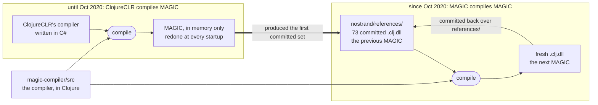
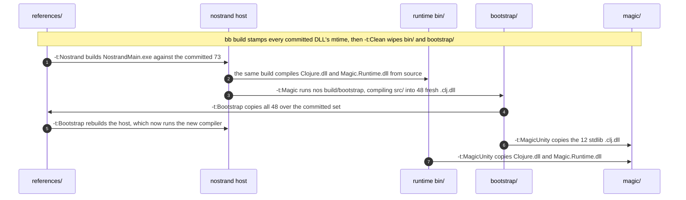
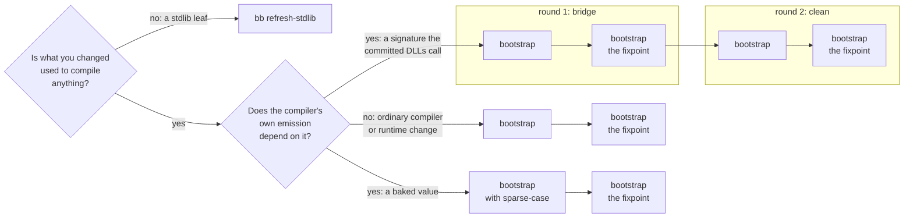
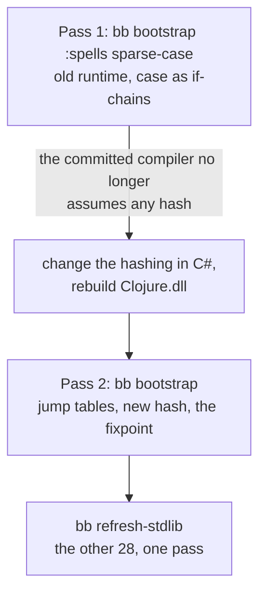
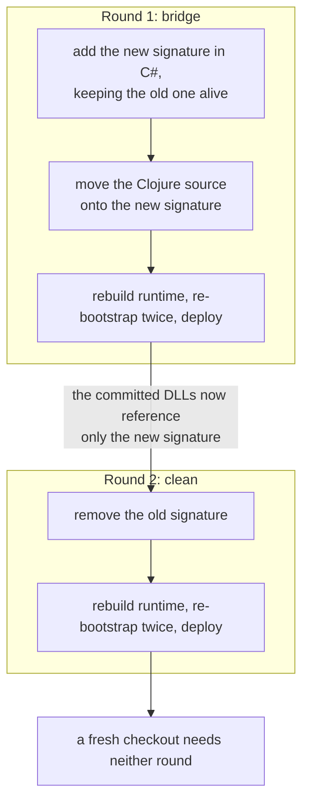
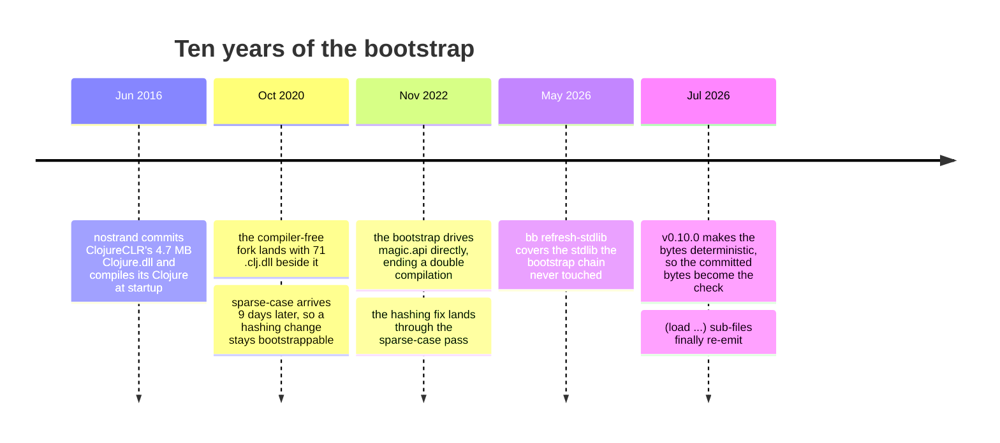

# The bootstrap

MAGIC compiles Clojure source into .NET assemblies. You hand it `.clj` files, it emits MSIL and packages that into a `.dll` the CLR loads and runs like any C# output. One namespace becomes one assembly, named after it: `magic.core` compiles to `magic.core.clj.dll`. Nothing is compiled at run time, which is the whole point ([why MAGIC](./why-magic.md)).

MAGIC is itself written in Clojure. So the compiler is just another Clojure program that MAGIC compiles into .NET assemblies, and the version you run today was compiled by the version before it. That is **bootstrapping**, and it is how the compiler moves forward.

Improving the compiler therefore means three steps, always in that order: 
1. edit the Clojure sources under `magic-compiler/src/`
2. compile them using the committed DLLs
3. commit the source fix and the fresh DLLs. 

Keeping the DLLs in git buys two things. A clone gets a working compiler with no other toolchain involved. And the compiler gets a history: `git show <sha>:nostrand/references/magic.core.clj.dll` is the compiler as it stood at that commit, which makes bisecting a compiler regression cheap. The commit convention is what holds that together, a source fix plus a paired `chore(bootstrap): refresh ...` for the binaries it regenerated ([CONTRIBUTING](../CONTRIBUTING.md)).

Before it could compile itself, MAGIC was compiled by another compiler. Until October 2020 the sources were compiled by [ClojureCLR](https://github.com/clojure/clojure-clr), whose own compiler is written in C#, and nothing was kept.



ClojureCLR rebuilt MAGIC from source at every startup and kept nothing, so no MAGIC output existed in the tree at all. Self-hosting began the day that output was committed instead, and the 73 `.clj.dll` in `nostrand/references/` are what it grew into.

## What is committed, and why

Two directories hold committed `.clj.dll`, and only one of them holds a compiler.

| Directory | Holds | Loaded by |
|---|---|---|
| `nostrand/references/` | 73 `.clj.dll`: the compiler (26 `magic.*` plus `mage.core`), its analyzer dependency (9 `clojure.tools.analyzer.*`), and the stdlib (37 `clojure.*`) | `nos`, at every startup |
| `magic-unity/Runtime/magic/` | the same 37 stdlib `.clj.dll`, plus `Clojure.dll` and `Magic.Runtime.dll` | Unity, at play time and in players |

No compiler ships to Unity, because Unity never compiles Clojure. You compile with `nos` first, and Unity loads the result as ordinary .NET assemblies ([Unity integration](./unity-integration.md)).

A third copy exists and is not committed: `nostrand/bin/Release/net471/`. `NostrandMain.csproj` lists `references/*.dll`, so building the host copies all 73 there, next to `NostrandMain.exe`. That is the set a running `nos` actually loads, and `references/` is the source of truth that feeds it.

`Nostrand.cs` picks them up at startup, in one function. Here is the Nostrand boot:

```csharp
static void BootClojureAndNostrand()
{
    // the committed compiler, loaded as plain assemblies:
    // every .clj.dll sitting next to Clojure.dll
    var assemblyPath = Path.GetDirectoryName(Assembly.Load("Clojure").Location);
    foreach(var cljDll in Directory.EnumerateFiles(assemblyPath, "*.clj.dll"))
    {
        Assembly.LoadFile(cljDll);
    }

    // run their Initialize methods. Clojure exists after this, and so does MAGIC
    RT.Initialize(doRuntimePostBoostrap: false);
    RT.TryLoadInitType("clojure/core");
    RT.TryLoadInitType("magic/api");

    // the fork has no compiler, so clojure.core's compile, eval and load slots
    // are empty. binding them to magic.api is what makes them work, and nothing
    // that calls them ever knows whose compiler answered
    RT.var("clojure.core", "*load-fn*").bindRoot(RT.var("clojure.core", "-load"));
    RT.var("clojure.core", "*eval-form-fn*").bindRoot(RT.var("magic.api", "eval"));
    RT.var("clojure.core", "*load-file-fn*").bindRoot(RT.var("magic.api", "runtime-load-file"));
    RT.var("clojure.core", "*compile-file-fn*").bindRoot(RT.var("magic.api", "runtime-compile-file"));
    RT.var("clojure.core", "*macroexpand-1-fn*").bindRoot(RT.var("magic.api", "runtime-macroexpand-1"));

    // nostrand's own Clojure: compiled into memory by MAGIC, on every single run,
    // which is why none of it is committed
    RT.var("clojure.core", "*load-fn*").invoke("nostrand/core");
    RT.var("clojure.core", "*load-fn*").invoke("nostrand/tasks");
}
```

These 73 binaries are versioned like source, because for this compiler they are source: they are the only form of MAGIC that another MAGIC can be built from.

Since **v0.10.0** rebuilding unchanged sources produces the same bytes on any machine, with the last two nondeterminism holes closed in **v0.11.0**. That is what makes a byte diff worth running: after a rebuild, `git status` lists exactly the DLLs your fix affected and nothing else, and CI runs the same diff on every pull request, so a stale binary fails the build. [Deterministic compilation](./deterministic-compilation.md) covers how that holds.

## How to build the new DLLs

`bb build` runs the loop once. It is a chain of MSBuild targets moving bytes between directories, and `nostrand/references/` is both the first input and the last output.



Steps 4 and 5 are the round trip. `nostrand/references/` builds the host, the host compiles `magic-compiler/src/` into `magic-compiler/bootstrap/`, which is gitignored, and `bootstrap/` is copied back over `references/`. The host is then built a second time from those new bytes, so the `nos` you end up with runs the compiler you just built.

Two silent no-ops guard this path, both deliberate. `magic.api/compile-file` refuses to overwrite a DLL that already exists, and the MSBuild `Magic` target is skipped when `magic-compiler/bootstrap/` is already there. That is why the build runs `Clean` first, and why `bb bootstrap` deletes the directory by hand.

### What gets compiled, and in what order

48 namespaces get compiled in a fixed order. The order follows the require graph.

The compile step in the middle is `magic-compiler/build.clj`. It names those 48, and they are the first four rows below. The fifth row is the rest of the 73, and no part of `bb build` touches it.

| Group | Count | Owned by |
|---|---|---|
| the compiler: 26 `magic.*` plus `mage.core` | 27 | `bb bootstrap` |
| `clojure.tools.analyzer.*`, a pinned git dependency compiled here rather than shipped | 9 | `bb bootstrap` |
| `clojure.string`, `clojure.set`, `clojure.walk`, which the compiler requires | 3 | `bb refresh-stdlib` |
| `clojure.core` and the 8 units compiled with it, last | 9 | `bb bootstrap` |
| the rest of the stdlib (`pprint`, `spec`, `test`, `zip`, `datafy`, ...) | 25 | `bb refresh-stdlib` |

Six of the nine in that fourth row are not libraries of their own, whatever their DLL names suggest. `core_proxy`, `core_print`, `genclass`, `core_deftype`, `gvec` and `core_clr` each open with `(in-ns 'clojure.core)`, so everything they define lands in `clojure.core`, and `core.clj` pulls them in with `(load ...)` exactly as on the JVM. One namespace, split across seven files, emitted as seven DLLs. The other two are real namespaces: `clojure.core.protocols`, which `core.clj` loads, and `clojure.clr.io`, which it requires.

`clojure.core` goes last on purpose. Compiling it re-executes its top-level forms in the running image, which redefines `clojure.core/*load-paths*` and breaks `find-file` for everything after it.

The bootstrap is not a cold boot. `Nostrand.cs` has already loaded all 73 DLLs and initialised `clojure.core` before `build.clj` starts, so nothing has to be built before its dependencies. What the order buys instead is that each namespace is compiled against dependencies the same run just recompiled, rather than a mix of fresh and committed ones, and that nothing recompiled early breaks the process doing the compiling. `clojure.core` last is the sharpest case of the second.

## Which task to run

Three tasks write committed DLLs, and each owns a different slice of the 73.

`bb build` and `bb bootstrap` both produce the same 48 and deploy them the same way, with `dotnet build -t:Bootstrap;MagicUnity`. So steps 4 to 7 of the diagram above are the same for either. They differ in how they get there.

| | `bb build` | `bb bootstrap` |
|---|---|---|
| Needs a working `nos` already | no, it builds one | yes, it fails early without one |
| What it wipes | every `bin/` and `bootstrap/`, via `-t:Clean` | `magic-compiler/bootstrap/` only |
| How it reaches the compiler | `-t:Nostrand` then `-t:Magic` | calls `nos build/bootstrap` directly |
| Re-records `dll-sources.edn` | no | yes |
| Takes extra arguments | no | yes, forwarded to `nos build/bootstrap` |

Use `bb build` after a fresh clone, when there is no host to run yet. Use `bb bootstrap` for compiler work, which is most of the time. The forwarded arguments are how the `sparse-case` pass below is requested.

`bb refresh-stdlib` owns 28, every namespace under `magic-compiler/src/stdlib/**/*.clj` outside the `clojure.core` family, and is what to run after editing one. It recompiles them and copies each into `references/`, the host's `bin/Release/net471/`, and `magic/` in one go. When a namespace fails to compile it deploys nothing and exits non-zero, so a partial refresh cannot pass for a complete one.

`bb check-drift` therefore runs `refresh-stdlib` itself, and wants a fresh `bb build` in front of it. Between them, that is the only way to cover all 73.

### Why `clojure.core` cannot be refreshed

`bb refresh-stdlib` skips nine of the namespaces `build.clj` compiles, the `clojure.core` family, and the reason is `clojure.core` itself.

Compiling a Clojure file means evaluating its top-level forms as you go, because later forms need the `def`s and macros the earlier ones made. `core.clj` contains this:

```clojure
(def ^:dynamic *load-paths*
  (if load-code-from-filesystem?
    [(System.IO.Path/GetDirectoryName (.Location (.Assembly clojure.lang.RT)))]
    []))
```

One entry: the directory `Clojure.dll` sits in. Nostrand then pushes the project's source directories onto that vector at startup, and that is the only reason the compiler can find `magic-compiler/src/stdlib/clojure/pprint.clj` at all.

So compiling `core.clj` re-executes that `def` in the live process and `*load-paths*` snaps back to the one-element vector. Every source path is gone, and the next namespace compiled in that process dies on "Could not locate ... on load path". That is why `clojure.core` goes last, and why no other flow may touch it.

The six `(in-ns 'clojure.core)` sub-files are excluded with it, and so are `clojure.core.protocols` and `clojure.clr.io`, which `core.clj` pulls in: recompiling any of the eight re-emits `clojure.core`, which this flow cannot write.

### Split namespaces compile as separate units

`clojure.core` is not the only namespace split across files, and the split ones need care. `clojure/pprint/pretty_writer.clj` opens with `(in-ns 'clojure.pprint)` and is pulled in by `(load "pprint/pretty_writer")` from `pprint.clj`, which does the same for six other files.

Neither obvious approach works. Compiling a sub-file on its own fails, because the parent has to run first and intern the vars its forms reference. Leaving it to the parent fails differently: the parent's `(load ...)` goes through the mtime rule further down, which hands back the existing DLL rather than emitting a new one. That is how six `pprint` sub-files and `core_clr` stayed frozen at their 2020 and 2022 bytes for years.

`refresh.clj` handles it by reading each source's first meaningful line. Files starting with `(ns` compile first, as top-level units. The `(in-ns ...)` sub-files compile afterwards, each as its own explicit unit.

## How many passes your change needs

Some changes need one rebuild, most compiler changes need two, a baked-value change needs two with a spell on the first, and a signature change needs two rounds of two. A **pass** is one complete run of the build task, start to finish.

One question decides the count: **how much of the compiler sits downstream of what you changed?** Change a leaf and one pass is enough. Change something the compiler is built out of and one pass cannot be trusted, because that pass ran the old compiler. Change something the compiler's own code generation depends on and you need an intermediate step that assumes neither version.

The diagram below has one branch per case.



If you are not sure which branch your edit is on:

| What you edited | Branch |
|---|---|
| a stdlib source among the 25 leaves | leaf |
| `clojure.string`, `clojure.set` or `clojure.walk` | leaf, unless the compiler calls the behaviour you changed |
| a compiler `.clj`, or a C# runtime `.cs` | ordinary |
| a long-stale DLL you are regenerating | ordinary |
| how the runtime computes a value the compiler bakes, such as `hasheq` | baked value, and refresh the bootstrap set **and** the stdlib set |
| a runtime constructor or method signature | two rounds |

### A stdlib edit: one pass

25 of the 28 namespaces `bb refresh-stdlib` owns are **leaves**. They run, and nothing is ever compiled with them, so there is no circularity to converge. Recompile, deploy, done.

The other three, `clojure.string`, `clojure.set` and `clojure.walk`, are in `build.clj`'s list as well, because the compiler requires them. That changes nothing about the DLL: `bb refresh-stdlib` writes it, and no `magic.*` DLL has to be re-emitted because it moved. None of the three defines a macro or an inline, and `*direct-linking*` is off for the bootstrap, so every call the compiler makes into them resolves through a Var at load time.

What can put you on the two-pass branch is the behaviour you changed, not the file it lived in. The compiler calls these three while it compiles, so if you touch something it relies on, its own output moves too and you are in the ordinary case below. A `bb check-drift` after a fresh `bb build` tells you which happened.

One pass on the stdlib set is enough even for a baked-value change. A `case` jump table is built by `magic.core/case-compiler` calling `Util/hasheq` at compile time, and read by the compiled code calling the same `Util/hasheq` at run time, both out of the one committed `Clojure.dll`. Table and lookup come from the same function, so they cannot disagree.

### A compiler or runtime change: two passes

The first pass still runs the previous compiler, and each namespace macroexpands against its dependencies as the previous run left them, so it always carries old state. Only the second pass, compiled entirely against first-pass output, is the fixpoint. The committed set is always the fixpoint.

| Pass | Compiler used | What it proves |
|---|---|---|
| 1 | the old committed DLLs | the change compiles at all |
| 2 | pass 1's output | the fix survives being compiled by itself, so it is the fixpoint |

### A long-stale DLL: two passes

Same reason, arrived at from the other direction: pass 1 macroexpands against the stale state you are trying to replace. When `core_clr` was finally re-emitted, pass 1 also changed `clojure.core.clj.dll`, because the parent's `(load "core_clr")` picked up the edited source mid-unit and consumed different gensyms. Pass 2 loads the fresh DLL and settles.

### A baked-value change: two passes, the first with sparse-case

Most of what a `.clj.dll` references resolves at run time against the loaded `Clojure.dll`, direct linking included, which is a calling convention and not inlining. So a runtime method-body fix is an ordinary change. The exceptions are the values the compiler computes and bakes into its output at compile time: a `case` form becomes a jump table keyed on `Util/hasheq` results, and a `defrecord` bakes its type hash.

Change how the runtime computes a baked value and the ordinary two passes cannot work: the committed compiler's own `case` dispatch is keyed on values the new runtime no longer produces, so it cannot be trusted to compile its own replacement. The way through is a first pass that bakes no such value at all. For hashes that is the `sparse-case` spell, which compiles `case` as a chain of `if` forms.



Pass 2 is the fixpoint. The sparse-case compiler is built from the same compiler sources, so what it emits is what the final compiler emits, only its own `case` dispatch differs. A sparse-case round trip on an unchanged tree reproduces the committed bytes exactly.

The last box has its own history. `bc629a67` changed the `hasheq` of every qualified keyword, and the companion refresh one minute later (`1b898f5d`) regenerated only the bootstrap 48; `bb refresh-stdlib` was not run. The other 25 kept their old-hash tables. `clojure.spec.alpha` was one of them, so `s/cat`, `s/*` and `s/alt` began throwing `No matching clause: :clojure.spec.alpha/pcat` at run time with nothing failing at build time. The compiler was fine and spec was fine. One committed binary was three hours out of date.

**The rule:** a baked-value change is not done until both the bootstrap set and the stdlib set are refreshed. `bb check-drift` runs `refresh-stdlib` itself for exactly this reason.

The same reasoning explains a pin that otherwise looks like an oversight: `AssemblyVersion` stays at `1.0.0.0` in `Directory.Build.props` rather than following `version.edn`, because every emitted `.clj.dll` bakes it into its assembly references and tying it to the release version would invalidate all 73 on every release.

### A runtime signature change: bridge, then clean

The committed `.clj.dll` reference runtime constructors and methods by exact signature, with a `newobj` against one specific constructor. Change that signature in `Clojure.dll` and the committed DLL fails to load with `MissingMethodException`, so `nos` cannot start, so it cannot regenerate the DLL that would have fixed it. Source compatibility and binary compatibility are independent here.

This is the long branch. Each **round** takes the ordinary two passes, and the first must be finished before the second starts.



**The rule:** the two rounds land in history separately, bridge first. Each tree state stays buildable, so `git bisect` keeps working.

## What else goes wrong

Three traps that have nothing to do with pass counts.

### A committed DLL must not be older than its source

The loader picks between `clojure/set.clj` and `clojure.set.clj.dll` by which is newer, and git stores no mtimes, so after a clone the winner is luck. Every build task therefore stamps the committed DLLs before compiling anything, marking each DLL newer than its source unless `dll-sources.edn` says the source really changed. A run without the stamp corrupts nothing, but it recompiles dependencies from source, so it is no longer compiling against the committed set and DLLs written later in the run can move even though their own source did not.

**The rule:** never a raw `dotnet build` after a fresh clone, because it skips the stamping step. The loader's decision tree, the stamping diagram and `MAGIC_DEBUG_LOAD=1` are in [deterministic compilation](./deterministic-compilation.md).

### A Unity player build rewrites magic/ in place

After a Unity player build, the DLLs in `magic/` are no longer the bytes the compiler wrote.

The pre-build hook hands each assembly to Mono.Cecil ([Unity integration](./unity-integration.md) covers why), so those files come out as Cecil output rather than compiler output. It happens under both scripting backends, and the bytes differ even when no instruction changed. A Unity run can also flip the exec bit, so compare mode as well as bytes.

To get back to a clean state, restore the directory from HEAD (`git checkout -- magic-unity/Runtime/magic/`) or regenerate it with `bb refresh-stdlib` or `bb build`.

**The rule:** never commit `magic/` straight after a player build. And when a C# runtime fix means `magic/Clojure.dll` genuinely has to be committed, mind the order. `bb check-drift` restores `Clojure.dll` and `Magic.Runtime.dll` from HEAD, because both embed a `git describe` `SourceRevisionId` no rebuild can reproduce. So run `bb check-drift` **first**, then `dotnet build -t:MagicUnity`, then commit. The other order looks clean and ships the old DLL.

### A mono crash during assembly save

Mono sometimes segfaults inside `AssemblyBuilder.Save` while writing `clojure.core.clj.dll`, the largest assembly and the last one built, and the process exits 134. It is sporadic and every occurrence has been clean on retry. The crash lands before the deploy step and never touches the committed DLLs, so nothing corrupt can ship from it. Retry the pass.

## Where it came from

The process above did not arrive in one piece. Each rule was added when something showed it was needed, and the timeline is that order.



From June 2016 `nostrand` committed exactly one binary: ClojureCLR's full `Clojure.dll`, 4.7 MB at the time. `Main` called `RT.load("clojure/core")`, and the DLR compiler inside that DLL read the `.clj` sources at startup. Requiring `magic.api` compiled MAGIC on the spot, every run.

That changed in one commit, `ecddba98` (2020-10-12), titled "Start work on MAGIC Nostrand bootstrap", with the body "Working but not 100% reproducible yet". `Clojure.dll` drops from 5,967,360 bytes to 559,616, the compiler-free fork replacing the full runtime, and 71 `.clj.dll` appear next to it. `RT.load` gives way to the loop that still runs today. Eleven days later `References/` became `references/` and nostrand's own 8 `.clj.dll` were dropped, since its CLI and task code is recompiled into memory at every startup.

The first hazard showed up nine days in, when `sparse-case` was added to handle hash values that "break across runtimes". Two years later the contract work that fixed hashing for real used exactly that escape hatch. The same stretch replaced `clojure.core/compile` with the MAGIC API in `build.clj` (`903ae224`), ending a double compilation, and gave `build.clj` the explicit ordered list it still has.

The remaining changes all came from a committed binary going stale unnoticed. In May 2026 a `pprint` source fix went in with no committed DLL behind it, so whether the fix took effect came down to the mtimes a given clone happened to get. That exposed the real gap: the bootstrap chain ends at `clojure.core` and never touched most of the stdlib, so a fix there could not be re-emitted by any build flow. `bb refresh-stdlib` closed it (`254e387b`), and that is why the 73 are owned by two tasks today rather than one.

Two blind spots closed after that, and both are rules above. `case` jump tables meant a DLL could go stale from a C# runtime change its own source never mentions, which only a byte diff can see. And the seven `(load ...)` sub-files no flow re-emitted were still carrying their 2020 and 2022 bytes, which only became visible once a rebuild was expected to reproduce them.

Each of those changes replaced a step a maintainer had to remember with a CI check that fails when it is missed.
