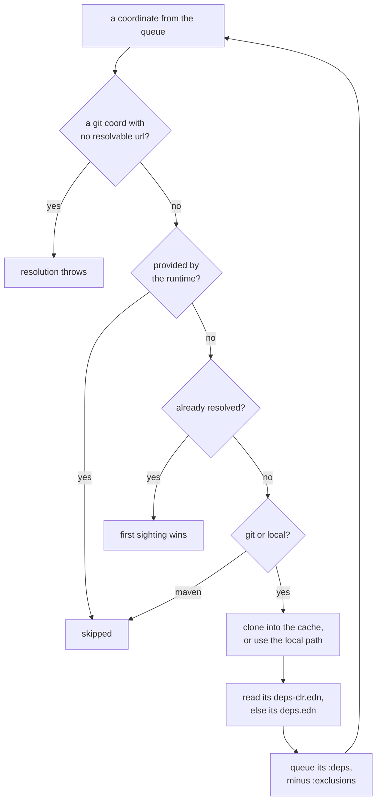

# Declaring CLR dependencies

There are three ways to declare the CLR dependencies of a library. This page covers all three, and how `nos` resolves what you write.

## `deps.edn` is not enough

The blocker is Maven. Neither `cljr` nor `nos` has a Maven procurer.

A JVM `deps.edn` nearly always declares `org.clojure/clojure {:mvn/version ...}` in its root `:deps`, and most JVM libraries arrive as Maven artifacts.

So we need another file to list the deps as git deps. Sometimes the CLR port lives in another repo, sometimes a JVM lib carries CLR support via reader conditionals, but all need to be fetched via git. The solution the ClojureCLR community went for is a dedicated `deps-clr.edn`. MAGIC now also supports it for consistency.

MAGIC also has another way to specify the JVM-CLR mapping directly in `deps.edn` using a dedicated `:clr` alias.

## The three setups

Pick one. The table compares them, and the sections after it cover each in turn.

| | none (`deps.edn` only) | `:clr` alias | `deps-clr.edn` |
|---|---|---|---|
| Read by | `nos` only | `nos` only | `nos` **and** `cljr` |
| Shared deps | declared once | declared once | repeated in two files |
| Drift risk | none | none | SHAs can fall out of sync |
| CLR-only path for consumers | no | no | yes |
| Best for | no dependency delta, `nos`-only | JVM-to-CLR lib swaps, `nos`-only | anything ClojureCLR may build |

`nos` skips Maven coordinates instead of failing on them, so all three work with `nos`. Only `deps-clr.edn` also works with `cljr`.

The first setup needs no file of its own. If every dependency you need on the CLR is a git or local coordinate that works on both runtimes, `deps.edn` alone is enough: `nos` resolves the git deps and skips any Maven coordinate it meets. A JVM-only test dependency declared under an alias as `:mvn/version` costs nothing, because the alias still contributes its `:extra-paths`.

## Recommended: `deps-clr.edn`, the ClojureCLR convention

This is the one we recommend, because it is the only setup `cljr` can build.

It can feel a bit overkill, especially if you have almost no CLR-only deps, but it is what makes your library build and test with `cljr`, the ClojureCLR CLI (see [clr.core.cli](https://github.com/clojure/clr.core.cli)), and that is the community standard to prove a lib supports the CLR. `nos` has read it since MAGIC 0.9.0, so a library already ported the ClojureCLR way needs no MAGIC-specific setup at all.

It is a self-contained file with its own `:paths`, `:deps`, and `:aliases`. Both `cljr` and `nos` read it in place of `deps.edn` when present, and the JVM tools never read it, so the JVM `deps.edn` stays untouched.

```clojure
;; deps-clr.edn
{:paths ["src"]
 :deps  {io.github.robertluo/fun-map {:git/sha "..."}}
 :aliases
 {:test {:extra-paths ["test"]
         :extra-deps  {org.clojure/test.check         {:git/url "https://github.com/flybot-sg/clr.test.check"
                                                       :git/sha "..."}
                       io.github.dmiller/test-runner  {:git/tag "v0.5.3clr"
                                                       :git/sha "ae91dd2727bbf70eb3a6d869a19953de3819dfbc"}}
         :exec-fn     cognitect.test-runner.api/test
         :exec-args   {:dirs ["test"]}}}}
```

Those two dependencies are the two shapes a CLR dependency comes in. `fun-map` is one repository serving both runtimes: its sources are `.cljc` carrying `:clj`, `:cljs` and `:cljr` reader conditionals, so the CLR loads the same code the JVM does. `clr.test.check` is the other shape, a CLR-only fork of `test.check`.

That is also why only one names a `:git/url`: `io.github.robertluo` implies `https://github.com/robertluo/fun-map.git`. `nos` infers from the same hosts `cljr` does, GitHub, GitLab, Bitbucket, Beanstalk and Sourcehut. A fork under another owner has to say where it lives.

### The cost: coordinates restated in two files

A runtime reads one file or the other, never a merge, so `deps-clr.edn` restates every coordinate shared with the JVM. That is its one cost: a git dep used by both runtimes has its SHA in two files, and bumping one while forgetting the other leaves both suites green while they test different code.

### What `nos` ignores in a file written for `cljr`

`nos` honors `:extra-paths`, `:extra-deps` and `:override-deps`. It ignores `:deps`, `:paths`, `:replace-deps`, `:replace-paths`, `:default-deps` and `:classpath-overrides`, which `cljr` honors, warning on stderr with the key named rather than quietly resolving something the file does not say. An undeclared alias warns too, as `tools.deps` does.

### Why the `deps.edn` fallback is not enough for `cljr`

`cljr` falls back to `deps.edn` when there is no `deps-clr.edn`, and the fallback itself works: a `deps.edn` holding only `:paths` and git coordinates resolves fine. What kills it is any `:mvn/version` coordinate in the resolved tree.

```
$ cljr -Spath
Error building classpath. Coord of unknown type: #:mvn{:version "1.9.0"}
```

A real dual-runtime library nearly always has one somewhere in its tree, so the fallback fails in practice.

## MAGIC-only: the `:clr` alias in `deps.edn`

This is an alternative to `deps-clr.edn`.

The alias keeps everything in one file, at the price of `cljr` never being able to build it.

This is the setup MAGIC 0.4.0 shipped. You map each JVM library to its CLR replacement under `:override-deps`. Maven deps are ignored, so the project must use git or local deps only.

```clojure
;; deps.edn
{:paths ["src"]
 :deps  {org.clojure/clojure         {:mvn/version "1.10.0"}  ;; dropped: the runtime provides it
         io.github.robertluo/fun-map {:git/sha "..."}} ;; use git deps so no need to add it in :clr
 :aliases
 {:clr  {:override-deps
         {org.clojure/test.check {:git/url "https://github.com/flybot-sg/clr.test.check"
                                  :git/sha "..."}}}
  :test {:extra-paths ["test"]
         :extra-deps  {org.clojure/test.check {:mvn/version "1.1.1"}}}}}
```

Only `test.check` needs an override, because only `test.check` lives somewhere else on the CLR. `fun-map`, a git coordinate both runtimes resolve, stays in the root `:deps` untouched, and the JVM never notices the alias exists.

`:override-deps` applies the replacement wherever the lib appears, transitive deps included, so shared coordinates stay declared once. `cljr` activates aliases too, but still chokes on the Maven coordinates around them, which is what makes this a `nos`-only setup.

### A shipped path reaches the JVM too

The downside of using an alias shows up with CLR-only load paths, the kind [a library's C# assembly](./native-assemblies.md) needs. You have to declare that path in the root `:paths` of `deps.edn`, which means it ships on the JVM too. That is only a problem if you also run the lib on the JVM.

## Activating aliases, since `nos` takes no alias flag

An alias does nothing until something activates it, and that holds in both files: the `:test` alias of a `deps-clr.edn` and the `:clr` alias of a `deps.edn` are activated the same way. On the JVM the command line does it (`clj -M:clr`). The `nos` commands take no alias flags, so the project states its aliases in `magic.edn`, which the built-in `nos build` and `nos test` read:

```clojure
;; magic.edn
{:build {:aliases [:clr]}
 :test  {:aliases [:clr :test]}}
```

`:nos/aliases` in the deps file predates `magic.edn` and covers what `magic.edn` does not: `nos repl` and hand-written task files, which activate it at boot. A library that only builds and tests can skip it. The full `magic.edn` surface is in [the `nos` CLI](./nos-cli.md).

## How `nos` resolves what you wrote

`nos` walks the dependency tree breadth-first, and the diagram below is what happens to each coordinate it meets.



**Which deps file.** `deps-clr.edn` if present, else `deps.edn`, at the root and for every resolved dep, the same preference `cljr` applies. A dep can therefore carry a CLR-only path in its own `deps-clr.edn`, a precompiled assembly's directory for instance, without it reaching its JVM `deps.edn`. `:nos/aliases` and `:nos/submodule-paths` come from whichever file wins.

**A dep's source paths.** `:paths` on the coordinate, else the dep's own deps file, else `src`. Coord `:paths` is a `nos` addition; `cljr` ignores it and reads a `pom.xml`. It is how `magic-compiler` reaches `org.clojure/tools.analyzer`, a pom-only lib, with `:paths ["src/main/clojure"]`.

**A submodule's source paths.** For each submodule, `nos` takes `:paths` from its `deps-clr.edn`, or from its `deps.edn` if it has no `deps-clr.edn`. If neither file declares `:paths`, it falls back to `src`, or `src/main/clojure` when that is the layout. Only paths are read: a submodule's own `:deps` are never resolved.

**Git and local coordinates only.** Anything else, Maven in practice, is skipped, counted and named on stderr at the end. That is what lets a `:test` alias contribute its `:extra-paths` while its JVM-only tooling goes unresolved.

**Three libs are dropped by name.** `org.clojure/clojure`, `org.clojure/spec.alpha` and `org.clojure/core.specs.alpha`: the runtime provides them, and the check runs before the coordinate type, so a git spelling does not bring them back. Nothing else is exempt, not even `clojure.tools.analyzer`, which `nos` ships compiled yet resolves normally.

**Coordinates read as `tools.deps` reads them.** Legacy `:sha` and `:tag` fold into `:git/sha` and `:git/tag`, both spellings at once is an error, `:local/root` resolves against its deps file's directory, and `:deps/root` picks a subdirectory of the clone. A missing `:git/url` is inferred from the group for the five hosts above; any other host throws rather than silently building a short classpath.

**Closest wins.** The sighting nearest the root is kept; later ones warn only on a real divergence, a short SHA and the full SHA it abbreviates counting as one commit. A coord's `:exclusions` drop those libs from everything below it.

**Where clones land.** `$GITLIBS/nostrand` when `GITLIBS` is set, keeping CLR checkouts apart from JVM entries in a shared cache, else `~/.nostrand/gitlibs`.

## Seeing what resolved: `nos print-basis`

When a dep resolves to something you did not expect, print the basis.

```bash
nos print-basis            # base :deps only
nos print-basis :clr :test # with aliases
```

It prints the paths and every lib with the SHA, tag or local root it settled on, compiling nothing. Cloning git deps into the cache is the one side effect.
