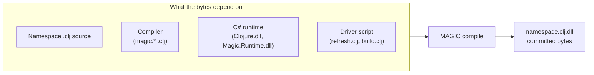
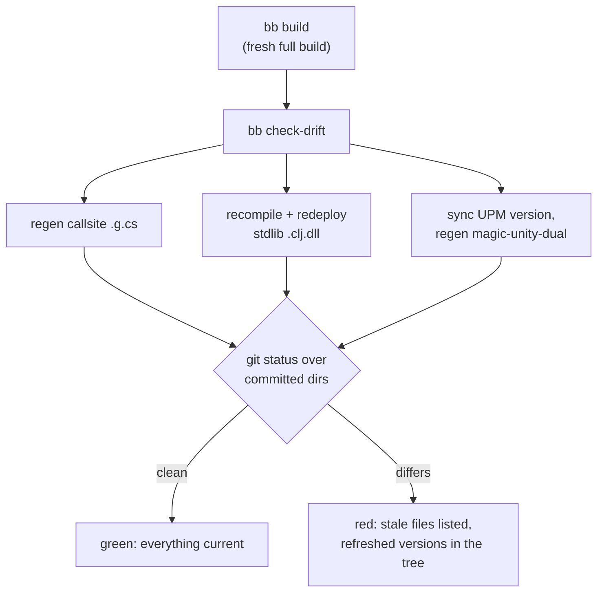

# Deterministic compilation and the drift check

This repo commits compiled binaries: the compiler is self-hosting, so `nostrand/references/*.clj.dll` ARE the compiler that compiles the next compiler.
`magic-unity/Runtime/Infrastructure/Export/*.dll` is the prebuilt runtime the Unity package ships.

Committed binaries can go **stale**: the checked-in bytes no longer match what a rebuild of the current sources would produce. This page explains how this happens, why we made compilation deterministic to catch it, and what `bb check-drift` actually checks.

## The problem: a DLL can go stale without its source changing

The obvious staleness is easy to guard: someone edits `clojure/spec/alpha.clj` and forgets to recompile `clojure.spec.alpha.clj.dll`. Hashing the source file catches that, and that is what we used to do, with two SHA256 manifests.

The staleness that actually bit us is the other kind. A change to the C# runtime altered `hasheq`, the hash function whose values the compiler bakes into the jump tables of every compiled `case` expression. Every committed DLL containing such a table was now wrong, yet not one `.clj` source had changed, so every source fingerprint stayed green. The bug only surfaced at runtime, as `No matching clause` deep inside spec, a long way from its cause.

The lesson: a compiled DLL is a function of much more than its own source. The diagram below shows everything that feeds the bytes.

A fingerprint of one input cannot guard an output that depends on four. The only fingerprint that covers them all is the output itself: the DLL bytes.

## Deterministic compilation makes bytes comparable

Byte-diffing compiled output is useless if the compiler emits different bytes on every run, and it used to. Two things varied:

- **Emission order.** Members were emitted by iterating hash-keyed collections (the lifted Var cache fields, the override methods of `reify`/`proxy`/`deftype`, the `Magic.Function` interface set). CLR identity hashes vary per process, so member order, and every IL offset behind it, reshuffled between runs. All three sites now sort by a content-derived key.
- **Assembly headers.** `Reflection.Emit` stamps a random **MVID** (a GUID identifying the module) and the current time in the PE header. After saving, we now zero the timestamp and rewrite the MVID as the SHA256 of the normalized file, so both derive from content.

With that, compiling the same namespace against the same toolchain produces byte-identical DLLs, verified across all 73 committed reference DLLs. Determinism is what turns `git diff` into a staleness detector.

## The drift check: rebuild, then diff

`bb check-drift` regenerates everything that is generated and fails if any checked path differs from HEAD:

The stdlib DLLs are recompiled by the check itself. The bootstrap set (`clojure.core`, `magic.*`, `mage`) is redeployed by the fresh `bb build` that precedes the check, both in CI and in the pre-PR sequence from [CONTRIBUTING.md](../CONTRIBUTING.md), so its drift shows up in the same diff. Run the check without a fresh build and you still cover callsites, stdlib, version, and the dual variant; you just lose the bootstrap coverage.

Byte-identity also holds across machines: a Linux container (mono 6.12) reproduces every committed DLL byte-for-byte from a macOS checkout (mono 6.14) at a different filesystem path. Three mechanisms originally tied the bytes to the environment, each found by diffing the IL of the same namespace compiled on both systems, and each is now fixed in the compiler:

- **Culture-sensitive sorting.** The emission sorts compared strings with the CLR's `String.CompareTo`, which follows the OS collation rules. They now compare raw UTF-16 units (`String/CompareOrdinal`), the same order the JVM uses.
- **Absolute source paths.** Every `def` bakes its `:file` metadata into the DLL, and MAGIC recorded the absolute path, so the checkout directory changed the bytes. `*file*` is now bound to the load-relative path (`clojure/zip.clj`), which is also what JVM Clojure records.
- **Global gensym state.** Auto-gensym numbers came from a process-global counter, so they carried whatever nostrand's boot and deps resolution had consumed, which varies by platform. The counter is reset at each file-writing compilation unit, making emitted names a function of the unit alone. This also means editing a driver script like `refresh.clj` no longer renumbers unrelated DLLs.

Two operational rules keep cross-machine identity true:

- **Committed DLLs must be mtime-newer than their sources.** `clojure.core/load-one` picks source vs DLL by mtime, and a fresh checkout leaves them ambiguous; loading a dependency from source consumes different gensyms and changes downstream bytes. `bb build`, `bb build-magic`, and `bb refresh-stdlib` touch the committed DLLs first, so use them rather than raw `dotnet build` after a fresh clone.
- **Rebuild twice after changing the compiler.** The compiler is self-hosting: the first pass still runs the previous compiler, so only the second pass's output is the fixpoint. The committed set is always the fixpoint.

CI runs the full byte-diff (`bb build` then `bb check-drift`). For an environment whose toolchain fails to reproduce the bytes, `bb check-drift skip-dlls` is the fallback: it restores the committed DLLs and checks `magic-compiler/dll-sources.edn` instead, the recorded SHA256 of each `.clj` source behind a committed DLL. That still catches a source edited without its DLL refreshed, but is blind to compiler and C# runtime triggers. The byte-diff is what closes that blind spot: re-running the hasheq scenario from the top of this page now flags 11 stale DLLs, `clojure.spec.alpha` among them.

When the check goes red, the working tree already holds the refreshed files. If the drift is expected, commit them as the paired refresh commit (`chore(bootstrap): refresh <name> DLL for <reason>`); if it is not, investigate before reverting, because an unexplained byte change means one of the four inputs above changed behavior.

## The edges worth knowing

Three behaviors follow from "bytes are the fingerprint" and surprise people once each:

- **`Export/Clojure.dll` and `Export/Magic.Runtime.dll` are never byte-diffed.** Their csproj stamps a `SourceRevisionId` from `git describe` into the assembly, so their bytes change with every commit by design and no rebuild can reproduce the committed ones. `check-drift` restores these two from HEAD; maintainers refresh them deliberately.
- **Editing a driver script renumbers gensyms downstream.** Clojure's gensym counter is process-global, and loading `refresh.clj` or `build.clj` consumes gensyms before any namespace compiles. Edit the driver and the next rebuild re-emits the DLLs compiled after it with shifted `G__N` names. The churn is benign, assembly-internal renames only, and the answer is the same paired refresh commit.
- **After changing runtime semantics, refresh twice.** A namespace macroexpands against its dependencies as loaded from the previous run's DLLs, so the first refresh after a semantic runtime change can still carry old expansion state. The second pass, compiled entirely against first-pass output, is the fixpoint. This is the same reason `bb build-magic-portable` exists as a two-pass protocol for hash changes.
