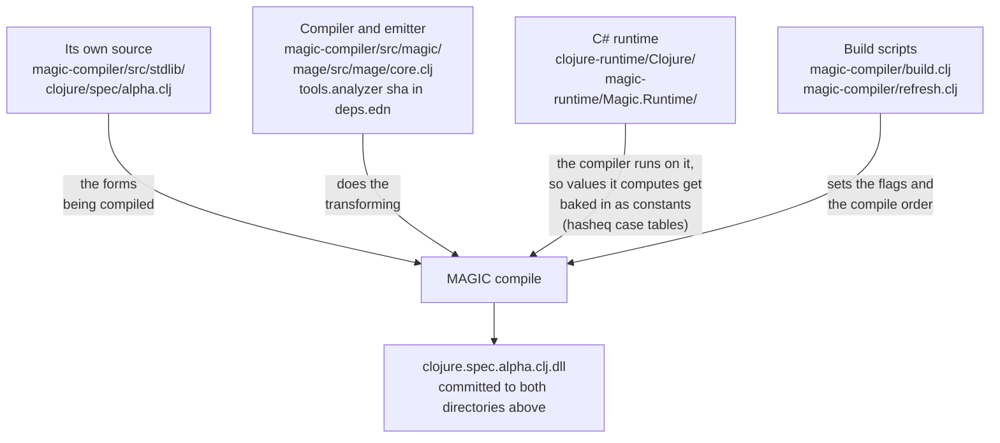
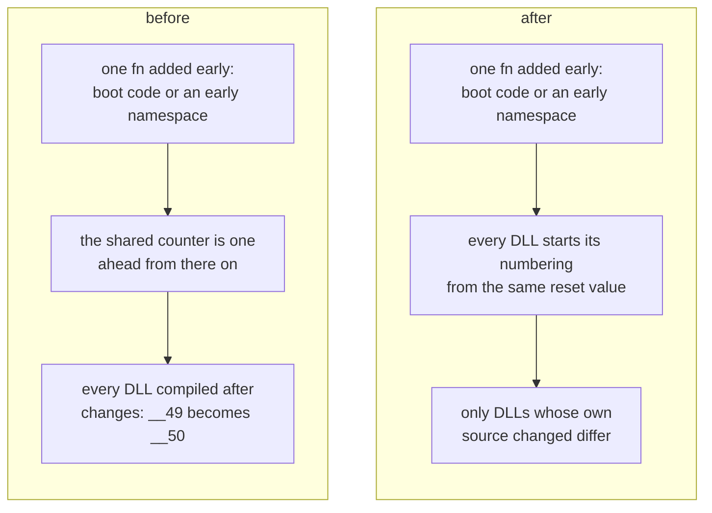
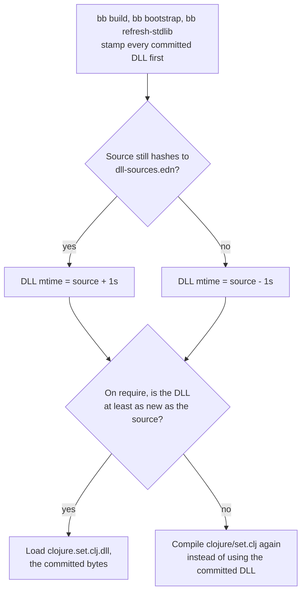
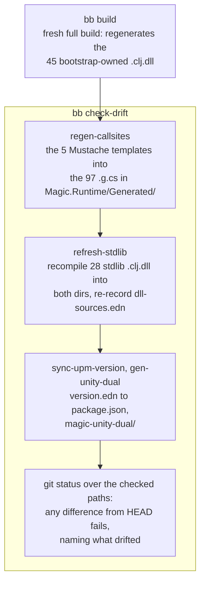
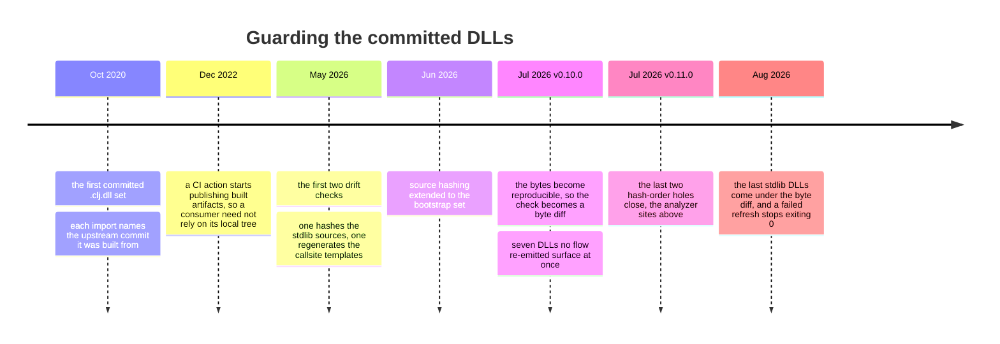

# Deterministic compilation and the drift check

MAGIC compiles deterministically since v0.10.0, with the last two nondeterminism holes closed in v0.11.0: the same sources and the same toolchain produce the same bytes, on any machine.

That is what makes the drift check simple. After a bootstrap reaches its fixpoint (two passes when the compiler changed, [the bootstrap](./bootstrap.md)), `git status` names exactly the committed DLLs a fix affected, and CI byte-diffs every one of them against a fresh rebuild. A committed DLL whose bytes no longer match that rebuild has **drifted**. Before the bytes were reproducible there was nothing to compare, so the check hashed sources instead, and a whole class of staleness got through.

Two directories hold those committed binaries: `nostrand/references/`, the 73 `.clj.dll` that are the compiler and stdlib themselves, and `magic-unity/Runtime/magic/`, the 37 stdlib `.clj.dll` plus the two C# runtime DLLs that Unity ships. What each holds and why is in [the bootstrap](./bootstrap.md#what-is-committed-and-why).

## A DLL can go stale without its source changing

There are two kinds of staleness, and telling them apart is the whole design.

In the first, someone edits `clojure/spec/alpha.clj` and forgets to recompile `clojure.spec.alpha.clj.dll`. The source moved, so hashing the source finds it, which is what `dll-sources.edn` does.

The second never touches a `.clj`. A C# runtime change once altered `hasheq`, the hash function whose values the compiler bakes into the jump tables of every compiled `case` expression. Every committed DLL holding such a table had drifted, yet no `.clj` source had changed, so every source hash stayed green. No error, no stack trace, just `No matching clause` at runtime deep inside spec, a long way from its cause.

A source hash cannot see that second kind, ever.

## What the bytes of one DLL depend on

A compiled DLL is a function of much more than its own source. The diagram takes `clojure.spec.alpha.clj.dll` and shows everything that feeds its bytes.



## Making the bytes reproducible

Byte-diffing compiled output is useless if the compiler emits different bytes on every run, and it used to.

Making it deterministic took four changes:

### 1. Hash-order iteration

The same `reify`, compiled twice, used to emit its methods in two different orders:

```clojure
(reify System.IDisposable (Dispose [_] ...)
       Object             (ToString [_] ...))
```

```text
the generated type before the fix, as monodis showed it:

run 1:                            run 2:
.method public Dispose  ...       .method public ToString ...
.method public ToString ...       .method public Dispose  ...
```

Same source, two byte-different DLLs: member order moves every method body, and every IL offset behind it moves too.

The compiler collects those override methods in a map keyed by `MethodInfo`, and a `MethodInfo` is a host object with no value to hash: it hashes by identity, from a handle the CLR assigns per process, so a map of them iterates in a different order in every process. The same goes for `Type` and `Var` objects. Clojure's value hashing (`hasheq`) plays no part in this; only host objects hash that way.

Five sites read collections that way, and each now sorts by a key built from the content:

| Site | What hash order used to decide | The sort now |
|---|---|---|
| the lifted Var cache fields | field order on the generated class | `(sort-by var-name u/ordinal-str-compare)` in `magic/spells/lift_vars.clj` |
| the override methods of `reify`, `proxy` and `deftype` | member order, and every IL offset behind it | `(sort-by (comp stable-method-key key) u/ordinal-str-compare)` in `magic/core.clj` |
| the `Magic.Function` interface set | interface order on the fn type | `(sort-by str u/ordinal-str-compare)` in `magic/core.clj` |
| `fresh-type`, which reuses generated types | which type gets reused | `(sort-by #(.Name %) ...)` in `magic/analyzer/generated_types.clj` |
| loop binding-type inference | which type a binding gets | `(sort-by str ...)` in `magic/analyzer/loop_bindings.clj` |

The Var cache fields come from the `lift-vars` spell: each referenced Var becomes a static field (`clojure_core$inc`), so a body loads a field instead of resolving the Var. For override methods the sort key is the whole signature, with the metadata token only as a tiebreaker:

```clojure
;; magic/core.clj
(defn stable-method-key
  "Signature string totally ordering override methods for deterministic emission
   (MethodInfo maps iterate in per-run handle-hash order). Token breaks any tie."
  [method]
  (str (.DeclaringType method) "|"
       (.Name method) "|"
       (string/join "," (map #(str (.ParameterType %)) (.GetParameters method))) "|"
       (.ReturnType method) "|"
       (.MetadataToken method)))
```

Every one of those sorts compares ordinally, never with `compare`: `compare` on strings calls `String.CompareTo`, which follows the OS collation rules, so the same sort could order differently on another machine.

```clojure
;; magic/util.clj
(defn ordinal-str-compare
  "Compare by raw UTF-16 units: CLR String.CompareTo (what compare uses)
   is culture-sensitive, so sorting with it varies across machines."
  [^String a ^String b]
  (String/CompareOrdinal a b))
```

### 2. Absolute paths in `:file` metadata

Every `def` bakes its source's `:file` path into metadata. It used to be the absolute path, so the checkout directory changed the bytes. It is now the load-relative path, e.g. `clojure/zip.clj` instead of `/home/me/magic/magic-compiler/src/stdlib/clojure/zip.clj`, as on JVM Clojure.

### 3. The gensym counter

Gensym and generated-type numbers come from counters that used to be global to the process, and everything `nos` does before compiling your file consumes them: booting compiles nostrand's own Clojure in memory, resolving dependencies runs more. Any change to that prelude shifts every number your file bakes. Every anonymous fn becomes a generated type, and each generated type takes one tick of the type-name counter, so adding a single `#()` to `nostrand/core.clj` once renumbered every committed stdlib DLL, the only content difference being `__49` becoming `__50` in each:



The reset happens only for file-writing compiles, so emitted names are a function of the namespace and toolchain alone, and REPL evals keep globally unique gensyms.

### 4. Assembly headers: MVID and timestamp

`Reflection.Emit` stamps two things into the [PE](https://learn.microsoft.com/en-us/windows/win32/debug/pe-format) header that say nothing about the code. We rewrite both once the file is on disk:

| PE header field | What `Reflection.Emit` writes | What `normalize-assembly!` writes instead |
|---|---|---|
| **MVID**, the GUID identifying the module | a fresh random GUID on every run | the SHA256 of the file, shaped into a well-formed GUID |
| Timestamp | the time of the build | zero |

The order matters. Both fields are zeroed first, then the file is hashed, then the hash goes into the MVID slot. Hashing only after they are cleared is what makes the result reproducible, since a file cannot contain the hash of itself.

## The mtime rule: loading the committed set

Determinism makes a rebuild reproducible only when it compiles against the committed set, and after a clone that is not a given.

For each `require` the loader picks between the source and its one paired assembly, newest [mtime](https://en.wikipedia.org/wiki/MAC_times) (the filesystem's last-modified timestamp) wins. The pairing follows the extension, so `clojure/set.clj` pairs with `clojure.set.clj.dll` and `my/ns.cljc` with `my.ns.cljc.dll`. MAGIC inherits the rule from JVM Clojure, where AOT output is local build junk under `classes/` and the timestamps really do mean "the source moved on". Ours travels through git, which stores no mtimes, so after a clone every file carries the time git wrote it. The build tasks put a meaningful mtime back:



Recompiling is the branch to avoid. It is slower than loading, and the run is no longer compiling against the committed set, so DLLs written later in the same run can drift even though their own source did not change. That is why a raw `dotnet build` after a fresh clone is the thing to avoid. Set `MAGIC_DEBUG_LOAD=1` to watch which file the loader picks, with both timestamps.

## The drift check: rebuild, then diff

`bb check-drift` regenerates every committed output, then fails if any of them differs from HEAD.

The first version could not compare bytes that moved every run, so it hashed the sources instead, across two separate manifests. That is the design the `hasheq` bug walked straight through. Determinism collapsed the two rules into one, and the two manifests became the single `dll-sources.edn`, whose job today is stamping the mtimes above.

### What `bb check-drift` regenerates, and what it only restores



The callsite templates are the easy case: five Mustache templates, one per callsite shape, rendered once per arity into 97 committed `.g.cs` that compile into `Magic.Runtime.dll`. Plain text, identical every run.

`package.json` is checked because the monorepo keeps one version, in `version.edn`, which `Directory.Build.props` feeds to every C# project automatically. The Unity package's `package.json` is plain JSON that MSBuild cannot reach, so a task copies the version across and the check catches a `version.edn` bump that forgot it.

`refresh-stdlib` rewrites 28 of the 73 committed DLLs; the rest belong to `bb bootstrap` ([which task owns what](./bootstrap.md#which-task-to-run)). That is why the check wants a fresh `bb build` in front of it: CI runs that sequence, and so does the pre-PR checklist in [CONTRIBUTING.md](../CONTRIBUTING.md).

A refresh that fails to compile anything deploys nothing and exits non-zero, so a half-written set of committed DLLs is not a state you can reach. And a red run already holds its remedy: the regeneration happens before the diff, so the refreshed files are sitting in the working tree, ready for the paired refresh commit ([CONTRIBUTING.md](../CONTRIBUTING.md)).

## The one exception: the two C# DLLs in `magic/`

`magic/Clojure.dll` and `magic/Magic.Runtime.dll` are built by csproj, and their csproj stamps a `SourceRevisionId` from `git describe` into the assembly. Their bytes change with every commit by design, and no rebuild reproduces the committed ones. `check-drift` restores those two from HEAD, and maintainers refresh them deliberately.

## Where it came from

Staleness has been handled three ways over the years: by convention, where a DLL import named the upstream commit it was built from; by CI, publishing built artifacts so nobody had to rely on their local tree; and by a check inside the repo, first over sources and now over bytes.


