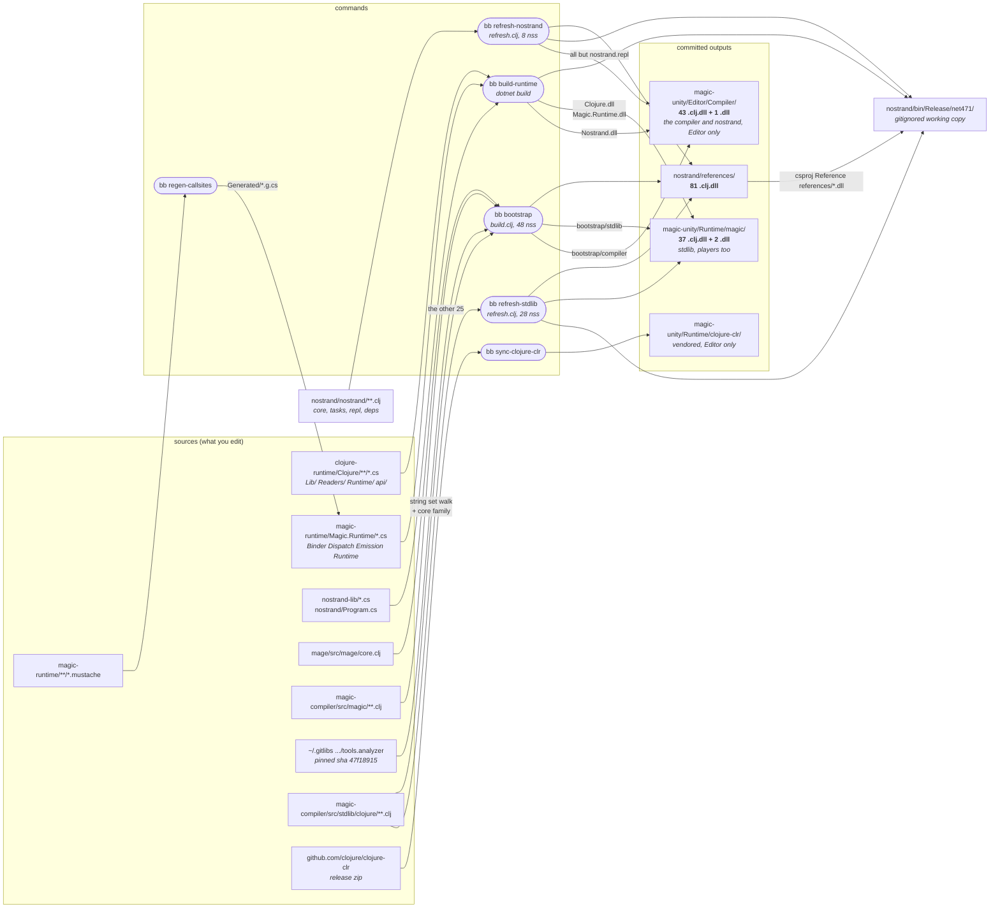

# Where every committed DLL comes from

MAGIC commits binaries to git, and they arrive from four different places: a C# build, two different Clojure compile tasks, and a vendored upstream release. This page is the lookup table for which command produced a given file. [The bootstrap](./bootstrap.md) covers why they are committed at all and how many passes a change needs; this page only answers "what made this file".

## The table

| Set | Count | Example DLL | Comes from | Built by |
|---|---|---|---|---|
| the compiler | 27 | `magic.core.clj.dll` | `magic-compiler/src/magic/core.clj` | `bb bootstrap` |
| the IL emitter (one of those 27) | 1 | `mage.core.clj.dll` | `mage/src/mage/core.clj`, a sibling repo directory rather than anything under `magic-compiler` | `bb bootstrap` |
| analyzer dependency | 9 | `clojure.tools.analyzer.ast.clj.dll` | `~/.gitlibs/libs/org.clojure/tools.analyzer/47f18915…`, a pinned git dep compiled here instead of shipped | `bb bootstrap` |
| stdlib the compiler itself calls | 3 | `clojure.string.clj.dll` | `magic-compiler/src/stdlib/clojure/string.clj` | both tasks: in `build.clj`'s list and in `refresh.clj`'s scan |
| the `clojure.core` family | 9 | `clojure.core_clr.clj.dll` | `magic-compiler/src/stdlib/clojure/core_clr.clj`. Six of the nine open `(in-ns 'clojure.core)`, so one namespace ships as seven DLLs | `bb bootstrap` only |
| stdlib leaves | 25 | `clojure.spec.alpha.clj.dll` | `magic-compiler/src/stdlib/clojure/spec/alpha.clj` | `bb refresh-stdlib` |
| `Clojure.dll` | 1 | | `clojure-runtime/Clojure/**/*.cs` | `bb build-runtime` |
| `Magic.Runtime.dll` | 1 | | `magic-runtime/Magic.Runtime/*.cs` plus `Generated/*.g.cs` | `bb build-runtime`, after `bb regen-callsites` |
| `Nostrand.dll` | 1 | | `nostrand-lib/*.cs`. The `nos` engine without the CLI around it, so the Unity Editor can drive the same boot. It is the one committed DLL with no `SourceRevisionId`, which is what lets the drift byte-diff cover it instead of restoring it from HEAD | `bb build-runtime` |
| nostrand's own Clojure | 8 | `nostrand.tasks.clj.dll` | `nostrand/nostrand/**/*.clj` | `bb refresh-nostrand`, run by `bb build-runtime`. Seven of the eight also go to `Editor/Compiler/`; `nostrand.repl` imports Mono.Terminal, which the package does not ship, and Unity refuses a plugin with an unresolvable reference |

48 + 28 - 3 shared + 8 = the 81 in `nostrand/references/`. Which task owns which slice, and why the overlap exists, is in [the bootstrap](./bootstrap.md#which-task-to-run).

## How the 81 split across the package

`nostrand/references/` holds all 81 in one directory. `magic-unity` ships 80 of them as two disjoint sets, because MSIL emission needs `Reflection.Emit` and so cannot run in a player:

| Package directory | Count | Which rows above | Loaded by |
|---|---|---|---|
| `Runtime/magic/` | 37 | stdlib the compiler calls 3 + the `clojure.core` family 9 + stdlib leaves 25 | the Editor and players |
| `Editor/Compiler/` | 43 | the compiler 27 + analyzer dependency 9 + nostrand's own 7 | the Editor only |

`Editor/Compiler/` also holds `Nostrand.dll`, which is C# rather than Clojure output and so counts in neither set. The partition check filters on the Clojure extensions for exactly that reason. The one reference DLL in neither set is `nostrand.repl.clj.dll`: `tasks.clj` reaches the REPL through `requiring-resolve`, so the Editor never loads it, and the check names it as the single allowed exclusion.

The split is one predicate applied in two places that have to agree. `build.clj`'s `stdlib-ns?` asks whether a namespace has a source under `src/stdlib` and writes its DLL to `bootstrap/stdlib` or `bootstrap/compiler`; `Magic.csproj` then deploys those two directories to the two package directories, and their union to `references/`. `refresh.clj` deploys nostrand's DLLs to `Editor/Compiler/` directly, since the bootstrap never compiles them. `bb check-drift` asserts the result really is a partition: every reference DLL in exactly one set, never both, none missing.

That check is blind to one thing, and so is every other check in the repo. Both deploys are MSBuild `<Copy>` with no delete, and `bb clean` removes only `bin/` and `magic-compiler/bootstrap/`, so a renamed or deleted namespace leaves its old DLL behind in every directory that held it. The result is still a valid partition; `git status` sees a committed file that did not change; and `dll-sources.edn` cannot tell the orphan from a vendored `clojure.tools.analyzer.*` DLL, which legitimately has no in-tree source either. Deleting or renaming a namespace means deleting its DLLs by hand.

## The two C# DLLs

`Clojure.dll` is a fork of [ClojureCLR](https://github.com/clojure/clojure-clr) (EPL-1.0): 782 types, mostly `clojure.lang` (`RT`, `Var`, `Symbol`, the persistent collections, `LispReader`) plus 358 `clojure.lang.primifs` arity interfaces for unboxed primitive calls. What matters is what is missing. Upstream's `CljCompiler/Ast/` directory and its Expr codegen classes do not exist in the fork, `Compile` and `Analyze` are commented out of `Compiler.cs`, and `Compiler.eval` is a live stub that throws `NotSupportedException`. That is the cut that took the DLL from 5,967,360 bytes to 559,616 in `ecddba98`, and it is why `Runtime.Boot` rebinds `*eval-form-fn*` and `*compile-file-fn*` to `magic.api`: the slots are empty and MAGIC fills them.

`Magic.Runtime.dll` is 331 types in a single `Magic` namespace, from about six hand-written files. Nearly all of the type count is arity fan-out (``CallsiteFunc`2..`21``, `CallSiteCache01..20`, one call-site class per arity), generated from the `.mustache` templates by `bb regen-callsites`. It references only `mscorlib` and `System.Core`, not even `Clojure.dll`.

## The edge that is easy to miss

`references/` feeding `bin/` is a dependency, not a build product. `NostrandMain.csproj` declares `<Reference Include="references/*.dll" />`, so building the host copies all 81 next to `NostrandMain.exe`, and that copy is what a running `nos` loads. This is the circularity: `bb bootstrap` compiles using the DLLs in `references/`, writes 48 new ones over them, then rebuilds the host so it runs the compiler that was just built. Only the second pass is compiled entirely against first-pass output, which is why a compiler change needs two.
