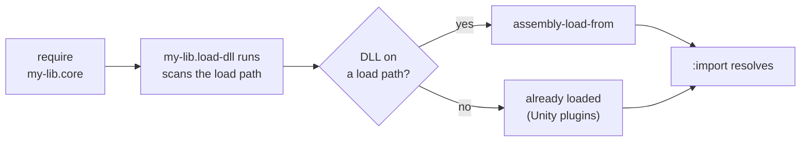

# Loading precompiled native assemblies

A library sometimes mixes Clojure source with C# compiled ahead of time to a plain assembly committed to the repo, say a hand-written parser class built with `csc`. On the JVM the equivalent, `.class` files on a `:paths` directory, just works: the classpath is how types get resolved. The CLR has no classpath for types. `:import` only searches assemblies already loaded in the process; it never loads one. So something must call `assembly-load-from` before the importing namespace is analyzed, or the `:import` fails with a missing type.

This is not a MAGIC quirk. Stock ClojureCLR behaves the same way, and its `assembly-load` / `assembly-load-from` / `assembly-load-file` are the official mechanism; there is nothing higher-level, on either `cljr` or `nos`. Every CLR Clojure library that ships a precompiled assembly has to load it explicitly. The only question is where that load lives.

## The recommended pattern: a loader namespace

The official way to load an assembly is `assembly-load-from`, called before the `:import` runs. The common shortcut is to hardcode the DLL's path, but that breaks the moment the library is consumed from another directory. Instead, scan `CLOJURE_LOAD_PATH` (the CLR's load path) for the DLL from a small namespace, and require it from the namespace that does the `:import`. Clauses run in written order, so put the `:require` before the `:import`, and the assembly loads first. This is the plain stock-ClojureCLR pattern, and it works unchanged on MAGIC because `nos` puts the project's `:paths` on `CLOJURE_LOAD_PATH` too:

```clojure
(ns my-lib.load-dll
  "The CLR does not load an assembly at :import; load the compiled DLL
   explicitly. Scan CLOJURE_LOAD_PATH, which carries the project :paths
   on both stock ClojureCLR and nostrand."
  #?(:cljr (:require [clojure.string :as str]))
  #?(:cljr (:import [System.IO Path File])))

#?(:cljr
   (let [roots (some-> (Environment/GetEnvironmentVariable "CLOJURE_LOAD_PATH")
                       (str/split (re-pattern (str Path/PathSeparator))))]
     (when-let [dll (some (fn [root]
                            (let [p (Path/Combine root "my_lib.dll")]
                              (when (File/Exists p) p)))
                          roots)]
       (assembly-load-from dll))))
```

The importing namespace requires it in the same `ns` form:

```clojure
(ns my-lib.core
  #?(:cljr (:require [my-lib.load-dll]))
  #?(:cljr (:import [my_lib MyParser])))
```

The directory holding the DLL (say `src_classes`) must be on the project's `:paths`, so the scan finds it. The diagram below shows the order.



## Why the load must be in-band

Keeping the load in the require graph is what makes it work everywhere, with no toolchain support. One placement covers every case:

- `nos build` and `nos test`, including MAGIC AOT compile time: the compiler evaluates top-level forms as it compiles, so the assembly is loaded before the `:import` is analyzed.
- Stock ClojureCLR's `cljr`, which puts `:paths` on the same `CLOJURE_LOAD_PATH` the loader scans.
- Consumers pulling the library as a git dep: their require of `my-lib.core` runs the loader in their own process.
- Unity players: the scan finds nothing and the loader is a no-op, which is correct, because assemblies under `Assets/Plugins` are already loaded.

## Parity libraries

A library that must build on both stock ClojureCLR and MAGIC should pair the loader with a self-contained `deps-clr.edn` whose `:paths` include the DLL directory. Both `cljr` and `nos` read that one file and put every `:paths` entry on `CLOJURE_LOAD_PATH`, so the loader's scan finds the assembly on either runtime. See [Declaring CLR dependencies](./clr-dependency-files.md).

## See also

- [Declaring CLR dependencies](./clr-dependency-files.md)
- [Porting a Clojure library to MAGIC](./porting-libraries-to-magic.md)
- [Writing cross-platform Clojure](./writing-cross-platform-clojure.md)
