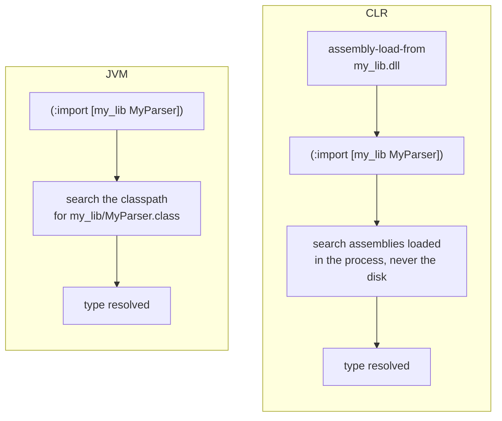
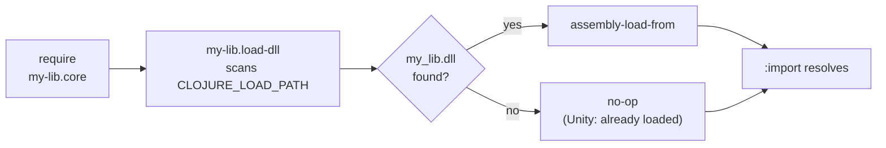
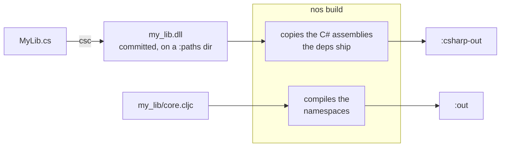

# A library's C# assembly

Some libraries ship a hand-written C# class next to their Clojure, compiled with `csc` and committed to the repo.

Three steps, in the order you do them: compile the class, load it into the process so `:import` can see it, then ship it with the Clojure that imports it.

## Build the DLL with `csc`

When the C# references Clojure types it has to compile against the same runtime assemblies the host will load, and `nos where` prints the directory they came from, so a build script never guesses at install paths:

```bash
csc -nologo -deterministic -target:library \
    -reference:$(nos where Clojure.dll) \
    -out:src_classes/my_lib.dll MyLib.cs
```

The flags, the compiler version and the `-out:` basename all land in the emitted bytes, so a DLL you commit needs the exact command recorded beside its source or a rebuild months later moves it for no reason anyone can name. [Committing an assembly you compiled yourself](./deterministic-compilation.md#committing-an-assembly-you-compiled-yourself) has the traps.

## Load it: a loader namespace

On the JVM loading a class costs you nothing, because the classpath is how types get resolved: you drop the `.class` files in a `:paths` directory and `:import` finds them.

The CLR has no classpath for types. `:import` resolves a type name against the assemblies **already loaded into the process**, and it never goes looking for a file.
So a fresh process has no idea your DLL exists, and the `:import` fails with a missing type even though the file sits right next to your source.
Something has to load the assembly first, which is the extra step in the diagram below.



This is not a MAGIC limitation. [ClojureCLR](https://github.com/clojure/clojure-clr) behaves the same way, and its `assembly-load`, `assembly-load-from` and `assembly-load-file` are the mechanism both runtimes give you. MAGIC inherits them, since its stdlib is a fork of ClojureCLR's.

Write a small namespace that loads the DLL, and require it from the namespace that imports the types. The tempting shortcut is to hardcode the DLL path, but that breaks the moment someone consumes your library from another directory. Instead scan `CLOJURE_LOAD_PATH`, the environment variable both runtimes fill from the project's `:paths`.

The loader is CLR-only, so it gets the `.cljr` extension and needs no reader conditionals:

```clojure
;; src/my_lib/load_dll.cljr
(ns my-lib.load-dll
  (:require [clojure.string :as str])
  (:import [System.IO Path File]))

(let [roots (some-> (Environment/GetEnvironmentVariable "CLOJURE_LOAD_PATH")
                    (str/split (re-pattern (str Path/PathSeparator))))]
  (when-let [dll (some (fn [root]
                         (let [p (Path/Combine root "my_lib.dll")]
                           (when (File/Exists p) p)))
                       roots)]
    (assembly-load-from dll)))
```

The importing namespace requires it in the same `ns` form. Reader conditionals are only read in `.cljc`, so that has to be the extension here:

```clojure
;; src/my_lib/core.cljc
(ns my-lib.core
  #?(:cljr (:require [my-lib.load-dll]))
  #?(:cljr (:import [my_lib MyParser])))
```

The clauses run in written order, so the loader has put the assembly in the process by the time the `:import` runs.



Several assemblies fold into one loader with a `doseq` over the filenames. The loader is idempotent: `require` runs it once per process, and `assembly-load-from` on a path already loaded returns the cached assembly.

MAGIC also has a `*load-paths*` var, but it is MAGIC's own, so a loader reading it breaks under `cljr`. Scan the environment variable.

Note that in Unity, `CLOJURE_LOAD_PATH` is unset in the Editor and in players, so the loader scans nothing and returns, and it has nothing to do there anyway: Unity loads every managed plugin under `Assets/` before any Clojure runs.

### Two rules for the DLL

- **Its directory must be a top-level `:paths` entry, in `deps-clr.edn` if the library ships one.** `:paths` is what `nos` and `cljr` turn into `CLOJURE_LOAD_PATH`, so anything outside it is invisible to the scan, and a `:clr` alias cannot carry it because a dependency's aliases are never applied: the directory would reach the library's own build and no consumer's.
- **Name it after the namespace prefix of the types inside it**, so `my_lib.MyParser` lives in `my_lib.dll`. That is what enables the hint MAGIC prints when an `:import` fails.

### The in-file variant in ClojureCLR libraries

ClojureCLR's own sources do not use a loader namespace. They load inline, in the file that needs the types, and move the `:import` out of the `ns` form so the load can run before it. From [`clojure/clr/io.clj`](https://github.com/clojure/clojure-clr/blob/master/Clojure/Clojure.Source/clojure/clr/io.clj), abridged:

```clojure
(ns clojure.clr.io
  (:import ...))   ; System.Net.Sockets is deliberately left out here

(try
  (assembly-load-from (str clojure.lang.RT/SystemRuntimeDirectory "System.Net.Sockets.dll"))
  (catch Exception e))

(import '[System.Net.Sockets Socket NetworkStream])
```

It works, and for a single importing namespace there is nothing wrong with it. Those cases know their directory up front (`RT/SystemRuntimeDirectory`), which is why they hardcode a path instead of scanning: a DLL shipped inside a library has no such fixed location.

### When the loader is missing

Nothing warns you in advance. The `:import` fails when it runs, and MAGIC's error names the DLL it spotted on the load path:

```
System.InvalidOperationException: Could not find type my_lib.MyParser during import; found /path/to/my-lib/src_classes/my_lib.dll on the load path but no loaded assembly defines this type, load it before :import, see docs/native-assemblies.md in the MAGIC repo
```

Under `nos build` and `nos test` this surfaces while the namespace compiles, and for a consumer it surfaces at `require`.

The hint appears when a DLL on the load path matches a namespace prefix of the unresolved type; the compiler appends it to `Unable to resolve symbol` errors too.

## Ship it: `nos build`

`nos build` compiles your Clojure and copies the DLL you built above. It never compiles C#.



```
$ nos build
Compiling my-app.core
Copying C# assembly my_lib.dll
Done.
```

It hashes the destination first and writes only what changed, so a build that touched no C# makes Unity reimport nothing. Two dependencies shipping the same file name with different content stop the build instead of overwriting each other.

Nothing prunes the destination. Drop a library from your deps and the next build names what it left behind, for you to delete:

```
$ nos build
Compiling my-app.core
No dependency ships old_lib.dll any more; delete it from Assets/Plugins/CSharp
Done.
```

The copies land in `:out` next to the compiled Clojure. `:csharp-out` sends them elsewhere, which is what a Unity project wants: [the `nos` CLI](./nos-cli.md#magicedn) defines the key, and [the two plugin folders](./unity-integration.md#the-two-plugin-folders) is why Unity splits them.

[unity-examples/magic-unity-smoke](../unity-examples/magic-unity-smoke) is the worked example: `csharp-lib/` ships an assembly and a loader, `smoke.csharp` imports its types, and the build sends the assembly to `Assets/Plugins/CSharp`.

## Under Unity

Unity treats the DLL as an ordinary managed plugin. Unlike the compiled Clojure assemblies it carries no define constraint, so both Editor runtimes load it and so does every player, Mono and IL2CPP alike. Nothing in it is MAGIC-aware.

### What IL2CPP will not let your C# do

MAGIC's own output already survives IL2CPP. Your C# carries the constraints of whatever profile the player uses, and two of them bite:

- **No runtime codegen.** `System.Reflection.Emit`, `Expression.Compile`, dynamic proxies: all of it works under Mono and throws under IL2CPP, which has no JIT. `nos test` will not catch this, since it runs on Mono.
- **Reflection over types nothing references statically** can be stripped from the player. Managed stripping keeps what it can see, so a type resolved only by name at runtime may be gone by the time you ask for it.

Neither is MAGIC-specific, but neither shows up until the IL2CPP build, which is the expensive place to find out. If the library is meant for Unity, exercise it in a player before you tag a release.
