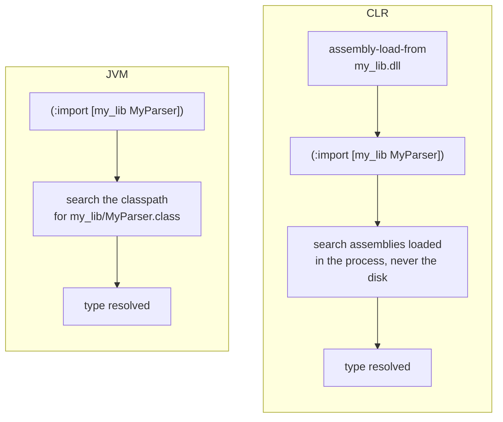
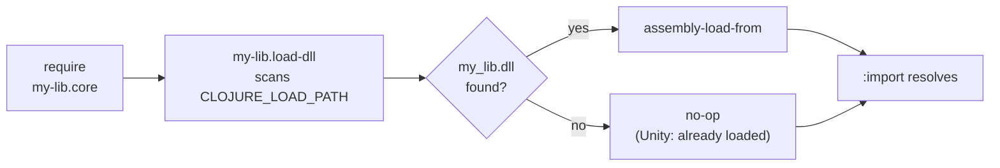

# Loading precompiled native assemblies

Some libraries ship a hand-written C# class next to their Clojure, compiled ahead of time with `csc` and committed to the repo.

On the JVM that costs you nothing, because the classpath is how types get resolved: you drop the `.class` files on a `:paths` directory and `:import` finds them.

The CLR has no classpath for types. `:import` resolves a type name against the assemblies **already loaded into the process**, and it never goes looking for a file.
So a fresh process has no idea your DLL exists, and the `:import` fails with a missing type even though the file sits right next to your source.
Something has to load the assembly first, which is the extra step in the diagram below.



This is not a MAGIC limitation. [ClojureCLR](https://github.com/clojure/clojure-clr) behaves the same way, and its `assembly-load`, `assembly-load-from` and `assembly-load-file` are the mechanism both runtimes give you. MAGIC inherits them, since its stdlib is a fork of ClojureCLR's.

## Recommended: a dedicated assembly loader namespace

You have a small namespace that loads the DLL, required by the namespace that imports the types. The tempting shortcut is to hardcode the DLL path, but that breaks the moment someone consumes your library from another directory. Instead scan `CLOJURE_LOAD_PATH`, the environment variable both runtimes fill from the project's `:paths`. MAGIC also has a `*load-paths*` var, but it is MAGIC's own, so a loader reading it breaks under `cljr`.

The loader is CLR-only, so it gets the `.cljr` extension and needs no reader conditionals:

```clojure
;; src/my_lib/load_dll.cljr
(ns my-lib.load-dll
  (:require [clojure.string :as str])
  (:import [System.IO Path File]))

(let [roots (some-> (Environment/GetEnvironmentVariable "CLOJURE_LOAD_PATH")
                    (str/split (re-pattern (str Path/PathSeparator))))]
  (when-let [dll (some (fn [root]
                         (let [p (Path/Combine root "my_lib.dll")]
                           (when (File/Exists p) p)))
                       roots)]
    (assembly-load-from dll)))
```

The importing namespace requires it in the same `ns` form. Reader conditionals are only read in `.cljc`, so that has to be the extension here:

```clojure
;; src/my_lib/core.cljc
(ns my-lib.core
  #?(:cljr (:require [my-lib.load-dll]))
  #?(:cljr (:import [my_lib MyParser])))
```

The clauses run in written order, so the loader has put the assembly in the process by the time the `:import` runs.



Three things have to line up:

- **The DLL's directory must be on the project's `:paths`.** That is what `nos` and `cljr` turn into `CLOJURE_LOAD_PATH`, so anything outside `:paths` is invisible to the scan. The directory name itself is free, `src_classes` in the examples here.
- **It must be a top-level `:paths` entry, in `deps-clr.edn` if the library ships one.** A `:clr` alias cannot carry it, because a dependency's aliases are never applied: the directory would reach the library's own build and no consumer's.
- **It is recommended to have the DLL named after the namespace prefix of the types inside it**, so `my_lib.MyParser` lives in `my_lib.dll`. It enables MAGIC's hint: when an `:import` fails, MAGIC searches the load path for a DLL whose name matches a namespace prefix of the missing type and points at it.

Several assemblies fold into one loader with a `doseq` over the filenames, several libraries compose with no coordination from the consumer, and the whole thing is idempotent, since `require` runs a loader once per process and `assembly-load-from` on an already loaded path returns the cached assembly.

Note that Unity players are the one place the scan finds nothing, since `CLOJURE_LOAD_PATH` is unset there. That is correct rather than broken, because assemblies under `Assets/Plugins` are already loaded before any Clojure runs.

### The in-file variant you will see in ClojureCLR libraries

ClojureCLR's own sources do not use a loader namespace. They load inline, in the file that needs the types, and move the `:import` out of the `ns` form so the load can run before it. From [`clojure/clr/io.clj`](https://github.com/clojure/clojure-clr/blob/master/Clojure/Clojure.Source/clojure/clr/io.clj), abridged:

```clojure
(ns clojure.clr.io
  (:import ...))   ; System.Net.Sockets is deliberately left out here

(try
  (assembly-load-from (str clojure.lang.RT/SystemRuntimeDirectory "System.Net.Sockets.dll"))
  (catch Exception e))

(import '[System.Net.Sockets Socket NetworkStream])
```

It works, and for a single importing namespace there is nothing wrong with it. Note that those cases know their directory up front (`RT/SystemRuntimeDirectory`), which is why they hardcode a path instead of scanning: a DLL shipped inside a library has no such fixed location.

## When the loader is missing

Nothing warns you in advance. The `:import` fails when it runs, and MAGIC's error names the DLL it spotted on the load path:

```
System.InvalidOperationException: Could not find type my_lib.MyParser during import; found /path/to/my-lib/src_classes/my_lib.dll on the load path but no loaded assembly defines this type, load it before :import, see docs/native-assemblies.md in the MAGIC repo
```

Under `nos build` and `nos test` this surfaces while the namespace compiles, and for a consumer it surfaces at `require`.

MAGIC adds a hint to guide the consumer: it appears when a DLL on the load path matches a namespace prefix of the unresolved type, and the compiler appends it to `Unable to resolve symbol` errors too.

## Building the assembly

How you drive `csc` is between you and Microsoft, with one MAGIC-specific part. When the C# references Clojure types it has to compile against the same runtime assemblies the host will load, and `nos where` prints the directory they came from, so a build script never guesses at install paths:

```bash
csc -nologo -deterministic -target:library \
    -reference:$(nos where Clojure.dll) \
    -out:src_classes/my_lib.dll MyLib.cs
```

`-deterministic` is there because the DLL is committed: without it Roslyn stamps a fresh module id and timestamp into every build, so rebuilding unchanged source dirties `git status` and you learn to ignore real changes. Mono's older `mcs` produces stable bytes without the flag and accepts it silently, so a build script can pass it always instead of detecting which compiler is installed.

One trap survives the flag rather than being caused by it. The assembly and module identity come from the `-out:` basename, and every C# compiler writes them into the metadata, so renaming the file afterwards does not rename the module inside it. Compiling to a temp name and moving it into place therefore produces a different DLL than compiling straight to the committed name. A temp directory is fine, a temp name is not. Without `-deterministic` you would never notice, because every rebuild churns anyway.

```bash
# stable: the module name is my_lib, the name the committed DLL already has
csc -deterministic -out:/tmp/build/my_lib.dll MyLib.cs
mv /tmp/build/my_lib.dll src_classes/

# not stable: the module name is tmp, so the bytes differ from the committed DLL
csc -deterministic -out:/tmp/build/tmp.dll MyLib.cs
mv /tmp/build/tmp.dll src_classes/my_lib.dll
```

[Deterministic compilation](./deterministic-compilation.md) covers why this repo cares so much about that property.

## If the assembly ships into a Unity player

The Clojure side of a library is compiled by MAGIC and already survives IL2CPP. Your C# is not, so it carries the constraints of whatever profile the player uses. Two of them bite:

- **No runtime codegen.** `System.Reflection.Emit`, `Expression.Compile`, dynamic proxies: all of it works under Mono and throws under IL2CPP, which has no JIT. `nos test` will not catch this, since it runs on Mono.
- **Reflection over types nothing references statically** can be stripped from the player. Managed stripping keeps what it can see, so a type resolved only by name at runtime may be gone by the time you ask for it.

Neither is MAGIC-specific, but neither shows up until the IL2CPP build, which is the expensive place to find out. If the library is meant for Unity, exercise it in a player before you tag a release.
