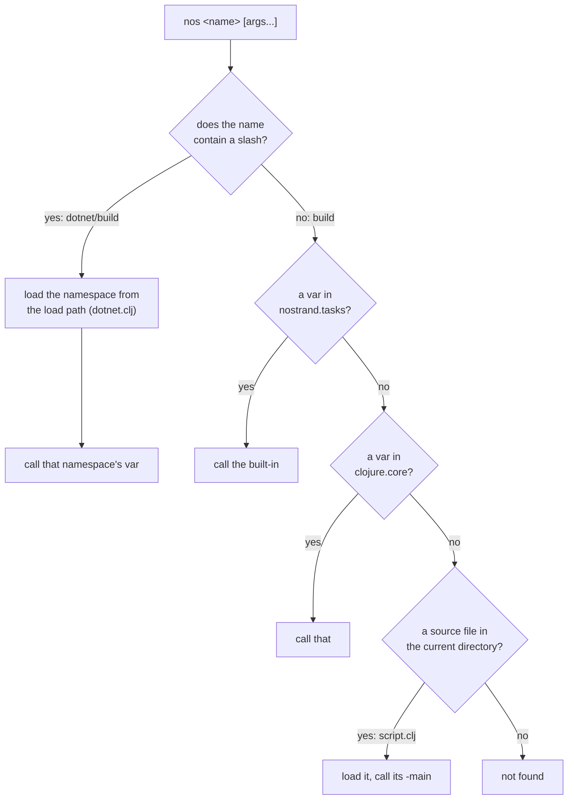

# The `nos` CLI

`nos` is for MAGIC what `clj` is for JVM Clojure and `cljr` is for ClojureCLR: the command that resolves your dependencies and runs your code. MAGIC needs one because it is a compiler and nothing more: it turns Clojure forms into MSIL and has no idea what a dependency or a test suite is.

`nos` is a C# executable that loads the committed compiler, resolves a `deps-clr.edn` or `deps.edn`, puts the resolved source paths on the load path, and then calls a Clojure function you name. Everything else it does is a function running inside that.

That last part is the shape worth holding on to. `nos` has no build DSL and no lifecycle. A task is a plain Clojure `defn`, and `nos build` is a `defn` that happens to ship with the host.

## Finding a task



So `nos dotnet/build` loads `dotnet.clj` from the current directory and calls `build` in it. The file name carries no meaning: `nos release/publish` loads `release.clj` just as happily. `dotnet.clj` is a convention inherited from the projects that came first, not a name the host knows.

Arguments are read as EDN, the whole command line at once. When that fails to read, `nos` retries argument by argument and passes any that still will not read through as a symbol, which is what lets an absolute path work: `/Users/me/f.clj` is not readable EDN, so it arrives as a symbol of that name.

`nos tasks` prints the docstring of every public var in every `.clj` file in the current directory. It documents your task files, not the built-ins.

## `nos build` and `nos test`

Two of the tasks that ship with the host do the work a project needs, which is why most projects need no task file at all.

```bash
nos build    # compile the project's namespaces into ./build
nos test     # run its clojure.test suites, exit 1 on any failure or error
```

Both derive the set of namespaces they work on rather than being told. They resolve the deps file, collect the source paths it contributes (the base `:paths`, plus the `:extra-paths` of each activated alias), and scan those directories recursively for `.clj`, `.cljc` and `.cljr` files, taking the namespace each one declares.

Neither task takes an alias flag. What they work on comes from a file.

## `magic.edn`

`magic.edn` is a convenience file to configure the build and test tasks as pure EDN at the project root.

It is a map with a `:build` and a `:test` sub-map. Every key has a default, so state only what differs, and omit the file entirely when nothing does.

```clojure
;; magic.edn
{:test {:aliases [:clr :test]}}
```

`nos test` turns that map into the call a task file would write by hand, `(tasks/run-clojure-tests :aliases [:clr :test])`, and `nos build` does the same with `:build` and `tasks/compile-project`. The file is pure configuration over `nostrand.tasks`, the functions [Task files](#task-files) below compose directly.

| Key | `:build` | `:test` | Meaning | Default |
|---|:-:|:-:|---|---|
| `:aliases` | yes | yes | deps aliases to activate | none, and `[:test]` for `:test` |
| `:namespaces` | yes | yes | explicit set, replacing the derivation | derived from the source paths |
| `:exclude` | yes | yes | namespaces to drop from the set | none |
| `:flags` | yes | yes | compiler flag overrides | the sets below |
| `:out` | yes | | compile output directory | `"build"` |
| `:clean?` | yes | | wipe `:out` first | `true` |
| `:re` | | yes | regex string scoping the run | the derived namespaces |
| `:exclude-vars` | | yes | `deftest` symbols to skip | none |

The file is spec-checked on read, so a malformed value fails with an explanation naming the key path.

Note the following:

- **`:re`** is matched with `re-matches`, so it has to match a namespace name whole. Write it as a string, since EDN has no regex literal: `"my\\.lib\\..*"`.
- **`:exclude-vars`** takes fully-qualified `deftest` symbols. After `require`, the run clears the `:test` metadata on each, so `clojure.test` skips exactly those vars and the rest of their namespace still runs. It is for a handful of platform-specific failures scattered through otherwise-passing namespaces, where excluding the namespace would throw away good tests. A symbol that does not resolve warns rather than failing.
- **`:namespaces`** is the escape hatch for what the derivation cannot see: a single compile root, or a vendored namespace no `require` reaches.

## Compiler flags

`nos build` compiles under the flags a shipped MAGIC project runs on:

```clojure
{#'*unchecked-math*                true
 #'*warn-on-reflection*            true
 #'magic.flags/*strongly-typed-invokes* true
 #'magic.flags/*direct-linking*         true
 #'magic.flags/*elide-meta*             false}
```

- `*unchecked-math*`: integer arithmetic compiles to raw CIL ops, no overflow checks.
- `*warn-on-reflection*`: interop the compiler cannot resolve statically warns at compile time.
- `*strongly-typed-invokes*`: a call whose `Magic.Function` type is statically known lowers to a typed interface call, skipping argument boxing.
- `*direct-linking*`: a call to a non-variadic, non-dynamic fn lowers to a direct `invokeStatic`, bypassing the Var.
- `*elide-meta*`: metadata expressions are dropped during analysis. Pinned off.

These five are what the built-ins set. The full surface, spells included, is [`magic.flags`](../magic-compiler/src/magic/flags.clj), one docstring per var.

`nos test` uses the same set with `*direct-linking*` and `*strongly-typed-invokes*` turned **off**, and that is not a detail: both lower a call so it no longer goes through the Var, so `with-redefs` has nothing left to rebind. Tests that mock would silently keep calling the real function.

The consequence is worth stating plainly. A green `nos test` says nothing about whether your library compiles and runs under the flags `nos build` uses. [Writing cross-platform Clojure](./writing-cross-platform-clojure.md) covers the code patterns that break only under those flags.

`:flags` merges over whichever base applies, so name the vars you change as fully-qualified symbols.

```clojure
{:build {:flags {magic.flags/*elide-meta* true}}}
```

## Task files

A task file is a namespace with public functions. It exists for work the built-ins do not do.

```clojure
;; publish.clj
(ns publish
  (:require [nostrand.tasks :as tasks]))

(defn nuget [] ...)
```

`nostrand.tasks` holds the pieces the built-ins are made of, so a custom task composes them instead of restating them. `compile-project` and `run-clojure-tests` take the same options as the `magic.edn` keys above, `production-flags` and `test-flags` are the two flag maps, and `project-namespaces` returns the derived set without touching the load path.

Older projects wrote a `dotnet.clj` defining `build` and `run-tests` by hand, before the built-ins existed. Those still work unchanged, and `nos dotnet/build` and `nos build` coexist in the same project.

```clojure
(ns dotnet
  (:require [nostrand.tasks :as tasks]))

(defn build     [] (tasks/compile-project :clean? true))
(defn run-tests [] (tasks/run-clojure-tests :aliases [:test]))
```

One difference to know if you keep one: `compile-project` defaults `:clean?` to `false`, while `nos build` defaults it to `true`.

## Diagnostics

| Command | What it tells you |
|---|---|
| `nos version` | the versions of the host, both C# runtimes, Clojure, and the CLR underneath |
| `nos where` | the directory the running host loaded `Clojure.dll` from |
| `nos where Clojure.dll` | that one assembly's full path, as bare stdout for `$(...)` capture |
| `nos print-basis [:alias ...]` | the resolved paths and libs, without compiling |
| `nos repl` | a REPL on a warm runtime |

`nos where` is what a build script uses to compile C# against the same runtime the host will load, instead of guessing at install paths ([native assemblies](./native-assemblies.md)). `nos print-basis` is the one to reach for when a namespace is missing and you cannot tell whether the dependency resolved ([declaring CLR dependencies](./clr-dependency-files.md)).

## What `nos test` cannot catch

`nos test` runs on Mono, which compiles at run time. Unity players use IL2CPP, which compiles to C++ ahead of time and has no JIT at all, so a whole class of failure exists only there: anything that emits code at run time, and anything reflected over that static analysis cannot see and stripping therefore removes.

No Mono run reaches those. A player build is the only thing that does ([Unity integration](./unity-integration.md)).
