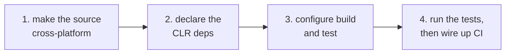
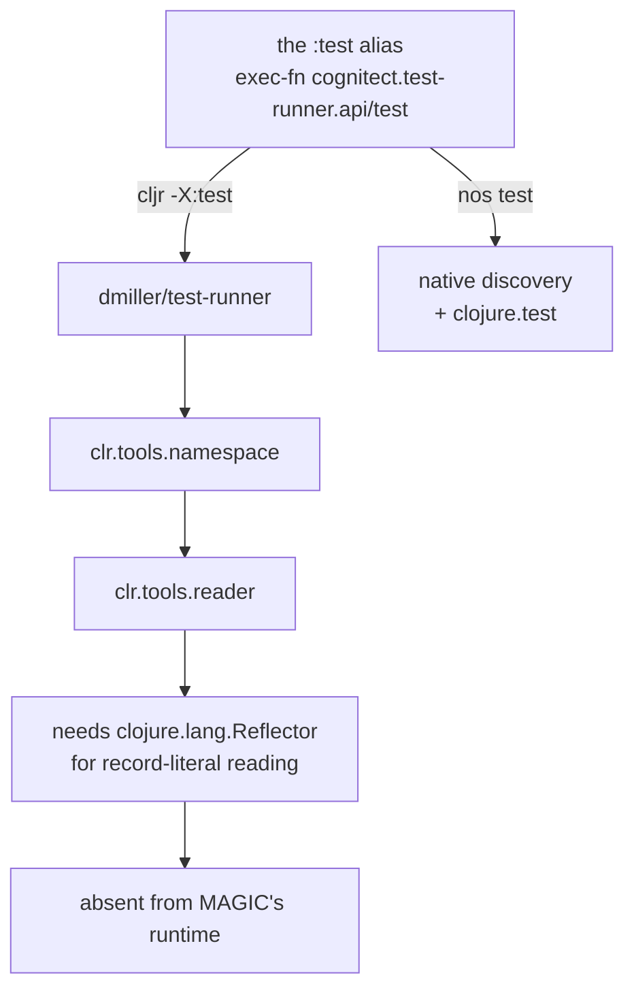

# Porting a Clojure library to MAGIC

Taking a library that runs on the JVM and making it compile and test on the CLR. Four steps, and this page is the order to do them in. Each links to the page that covers it, and the two things nothing else covers, testing and CI, are here in full.

Assumes `nos` is installed ([Install](../README.md#install)).



**1. Make the source cross-platform.** Move anything with host interop to `.cljc` and use reader conditional `:cljr` for the CLR parts. The extension precedence, the type hints worth adding, the host APIs that genuinely differ, and the Clojure 1.10 boundary are all in [writing cross-platform Clojure](./writing-cross-platform-clojure.md).

**2. Declare the CLR deps.** Write a `deps-clr.edn` at the project root with the CLR coordinates. Both `nos` and `cljr` read it in place of `deps.edn`, so the JVM file stays untouched and the library also builds under ClojureCLR. [Declaring CLR dependencies](./clr-dependency-files.md) covers that file, the older `:clr` alias alternative, and how `nos` resolves what you write.

**3. Configure build and test.** A `magic.edn` at the root states what differs from the defaults, usually the aliases and little else. `nos build` and `nos test` read it. The full option surface, the compiler flags each task uses, and custom task files are in [the `nos` CLI](./nos-cli.md).

**4. Run the tests and wire up CI.** The rest of this page.

If the library ships a precompiled C# assembly next to its Clojure, it needs a loader namespace as well: see [a library's C# assembly](./native-assemblies.md).

## Running the tests: two runners, not one

A library that builds on both ClojureCLR and MAGIC is tested by two different runners, and they want different things from the same `deps-clr.edn`.

`cljr -X:test` has no test runner of its own, so the alias carries one. This is [`fun-map`](https://github.com/robertluo/fun-map)'s, and it is the shape you will see across CLR libraries that were ported and tested with ClojureCLR:

```clojure
;; deps-clr.edn
{:paths ["src"]
 :aliases
 {:test {:extra-paths ["test"]
         :extra-deps  {io.github.dmiller/test-runner
                       {:git/tag "v0.5.3clr"
                        :git/sha "ae91dd2727bbf70eb3a6d869a19953de3819dfbc"}}
         :exec-fn     cognitect.test-runner.api/test
         :exec-args   {:dirs ["test"]}}}}
```

`nos test` cannot use this test-runner. It drives `clojure.test` directly, derives the namespace set from the source paths the aliases contribute, and takes its configuration from `magic.edn`:

```clojure
;; magic.edn
{:test {:aliases [:test]}}
```

```bash
nos test     # exits 1 on any failure or error
```

So the two ways to test coexist: the test runner in the `deps-clr.edn` test alias for `cljr`, `magic.edn` for `nos`. `:exec-fn` and `:exec-args` are ignored **silently** by `nos`: they are not on the list of keys it warns about, so nothing tells you they had no effect on a `nos test` run.

### Why `nos` does not use ClojureCLR's runner

It looks like duplicated effort, and the reason it is not comes down to what the runner is built on rather than to the runner itself.



`clr.tools.reader` reads record literals through `Reflector/InvokeConstructor` and `Reflector/InvokeStaticMethod`, which is runtime reflection over types chosen while the program runs. MAGIC's forked runtime does not ship `Reflector`, because resolving calls that way is the thing IL2CPP cannot do and the thing MAGIC exists to eliminate. So the chain stops in the first dependency, before it ever reaches the runner. Two smaller incompatibilities sit in front of that one and are both fixable, but this one is a design divergence: making it load would mean putting reflection back.

Nothing is lost, because the chain is redundant here. A test runner does four things: find test namespaces in some directories, load them, run `clojure.test`, and filter vars by metadata. `nos` already discovers namespaces by scanning those directories and reading each `ns` form with MAGIC's own reader, and `clojure.test` needs no help with the rest. `clr.tools.namespace` and `clr.tools.reader` exist to do the first step on a runtime without a compiler in it. MAGIC is a compiler.

The practical consequence for a dual-runtime library is small: keep the `cljr` runner in the alias for `cljr -X:test`, add a `magic.edn` for `nos test`, and expect both to run the same suites.

Two limits on a green `nos test`. It runs with direct linking and strongly-typed invokes off, so it says nothing about whether the library works under the flags `nos build` uses. And it runs on Mono, so it cannot reach the IL2CPP failures that only a Unity player build produces ([Unity integration](./unity-integration.md)).

## Rich comment tests

If the library's tests are [rich comment tests](https://github.com/robertluo/rich-comment-tests), they cannot run on the CLR as they stand: RCT extracts its assertions at run time through `rewrite-clj` and other JVM-only machinery.

[flybot-sg/rct-clr](https://github.com/flybot-sg/rct-clr) bridges it in one direction. On the JVM it reads the rich comments and writes out a plain `.cljc` file of ordinary `deftest` forms asserting with [matcho](https://github.com/flybot-sg/matcho). MAGIC then runs that generated file with nothing but `clojure.test` and `matcho.core`.

The rich comments themselves are inert on the CLR: they sit in `src` and the generated file carries the assertions. What cannot load is the JVM test namespace whose `deftest` calls the RCT runner, so exclude that one and let the generated namespace run like any other suite:

```clojure
{:test {:exclude [my.lib.rct-test]}}
```

Generation runs on the JVM, so `nos test` follows a `clojure -M:dev -m rct-clr.gen -o <file> -n <ns>` step rather than replacing it. `matcho` is the one extra CLR dependency it costs.

## CI

A job needs `mono` and `nos`. Flybot publishes [`ghcr.io/flybot-sg/ci-clj-clr`](https://github.com/flybot-sg/ci-clj-clr) with JDK, Clojure CLI, Babashka, Mono and a pinned `nos`, so one container runs both the JVM and CLR jobs. Pin the tag matching the MAGIC version you build against.

Git deps also have to survive between pipelines, and where that cache can live differs by platform. GitLab only caches paths inside the checkout, so move the cache there with `GITLIBS`. `nos` honours the same variable JVM tools.deps does, cloning under `$GITLIBS/nostrand/` where it cannot collide with the JVM entries, so one setting covers both jobs:

```yaml
# .gitlab-ci.yml
variables:
  GITLIBS: $CI_PROJECT_DIR/.gitlibs

cache:
  paths:
    - .m2/
    - .gitlibs/
    - .cpcache/
```

Make it absolute, built from `$CI_PROJECT_DIR`. A relative `GITLIBS` resolves against the working directory of whichever process reads it, which is not the same directory for every step.

GitHub Actions has nothing to relocate: add `~/.nostrand/gitlibs`, where `nos` clones when `GITLIBS` is unset, to the `actions/cache` paths and leave the variable alone.
