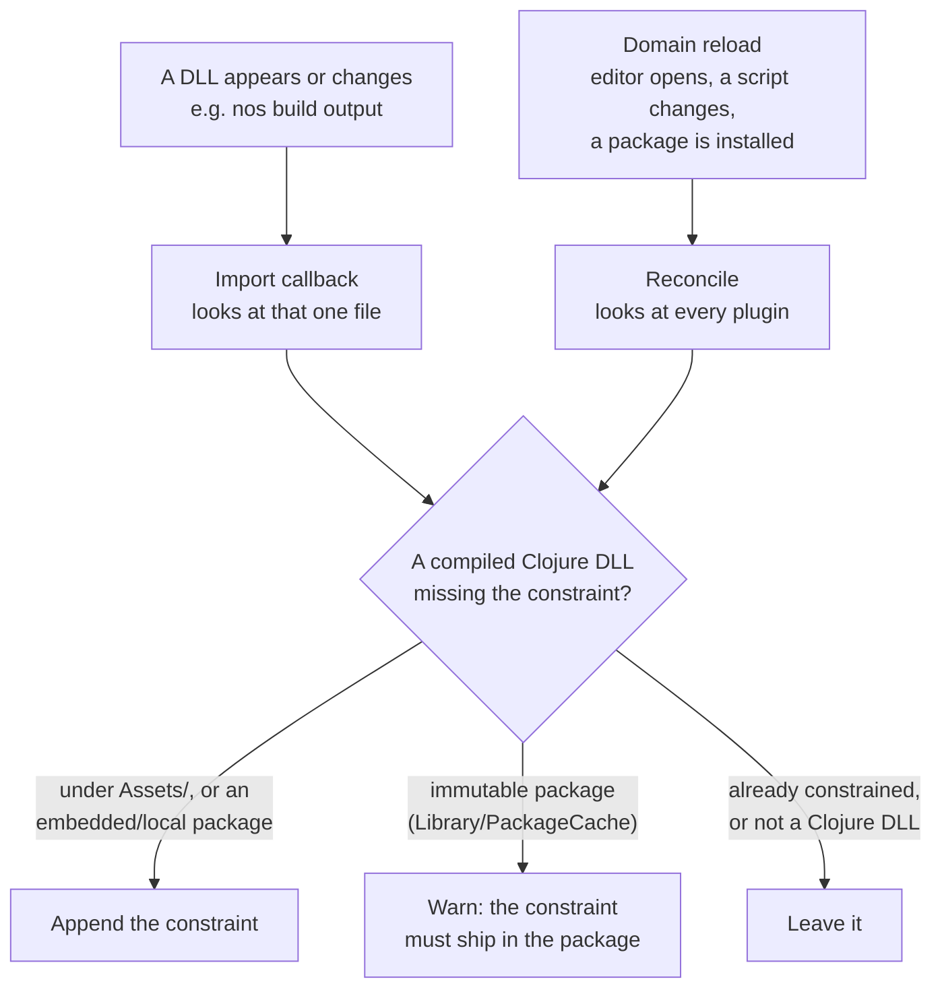

# Unity integration

How to use MAGIC in a Unity project: compile your Clojure to plugin DLLs with the `nos` CLI outside Unity, then load them at play time through the `magic-unity` UPM package. The package also rewrites MAGIC's IL during IL2CPP builds (iOS, Android, consoles).

This is the consumer-side guide. For the package's C# API and install reference, see [magic-unity/README.md](../magic-unity/README.md). For the compile workflow in depth, see [Porting a Clojure library to MAGIC](./porting-libraries-to-magic.md).

## Steps

1. **Install `nos`** (build-time only; needs the `mono` runtime, no .NET SDK). See [Install](../README.md#install) in the root README.

2. **Add the package** to `Packages/manifest.json`, pinned to a tag from the [releases page](https://github.com/flybot-sg/magic/releases):

   ```json
   {
     "dependencies": {
       "sg.flybot.magic.unity": "https://github.com/flybot-sg/magic.git?path=magic-unity#<tag>"
     }
   }
   ```

3. **Add `deps-clr.edn` and `magic.edn`** at your project root. `deps-clr.edn` declares your source `:paths` and any `:deps` (see [declaring CLR dependencies](./clr-dependency-files.md)); `magic.edn` points the build at Unity's plugins folder:

   ```clojure
   ;; magic.edn
   {:build {:namespaces [my.game.core]
            :out        "Assets/Plugins/Magic"
            :csharp-out "Assets/Plugins/CSharp"}}
   ```

   The two output folders are [explained below](#the-two-plugin-folders).

   A project with custom build/test steps can hand-write a `dotnet.clj` instead; see [the porting guide](./porting-libraries-to-magic.md).

4. **Compile before opening Unity:**

   ```bash
   nos build
   ```

   This drops your compiled DLLs into `Assets/Plugins/Magic/`, named by the source extension (`.clj.dll`, `.cljc.dll`, `.cljr.dll`), where Unity loads them.

   If a dependency ships a C# assembly, the build copies that into `Assets/Plugins/CSharp/`.

5. **Write a loader, then Play.** Unity doesn't know which DLLs are Clojure or which var is the entry point, so a `MonoBehaviour` has to require and invoke it (pattern: [`SmokeTestRunner.cs`](../unity-examples/magic-unity-smoke/Assets/Scripts/SmokeTestRunner.cs)):

   ```csharp
   using Magic.Unity;

   void Start() {
       Clojure.Require("my.game.core");
       Clojure.GetVar("my.game.core", "start!").invoke();
   }
   ```

   Editor Play mode needs MAGIC as the Editor runtime (see below); otherwise these calls drive ClojureCLR instead.

6. **Build a player to exercise the IL2CPP / AOT path.** Editor Play runs under Mono and can't surface IL2CPP-only regressions. The smoke example wires this to a one-click menu; see the [smoke README](../unity-examples/magic-unity-smoke/README.md#run). For CI without Unity, `nos test` runs the Mono-side tests headless but doesn't exercise IL2CPP.

## The two plugin folders

One folder works: `:csharp-out` defaults to `:out`, MAGIC loads the DLLs the same either way, and neither folder name means anything to the tooling. Split them anyway, because Unity treats a file that keeps being deleted differently from one that stays put.

```clojure
;; magic.edn
{:build {:namespaces [my.game.core]
         :out        "Assets/Plugins/Magic"
         :csharp-out "Assets/Plugins/CSharp"}}
```

|  | `Assets/Plugins/Magic/` | `Assets/Plugins/CSharp/` |
|---|---|---|
| Set by | `:out` | `:csharp-out`, defaults to `:out` |
| Holds | your Clojure, compiled | C# assemblies your dependencies ship |
| Written by | `nos build`, compiling your sources | `nos build`, copying files `csc` compiled long before |
| Wiped every build | yes, by `:clean?` | no |
| `.meta` | Unity writes it on import, then the package's hook constrains it | Unity writes it on import, nothing touches it after |
| Define constraint | `!UNITY_EDITOR \|\| MAGIC_RUNTIME_IN_EDITOR`, so the Editor loads it only under MAGIC | none, so it always loads, in both Editor runtimes and every player |
| In git | no, gitignore it | your call, `.meta` files included |

A library ships only the DLL. Everything else in that table is produced inside your project.

The "wiped every build" row is the reason. `:clean?` deletes `:out` before every compile, so an assembly sitting there is imported fresh each time and Unity mints it a new GUID. Anything that referenced the old one, a component on a scene object, another importer's settings, points at nothing. A `:csharp-out` of its own is never emptied, so the GUID holds.

Whether you commit that folder is a second, separate choice, and it comes down to who runs `nos build`. Commit it, `.meta` files included, and a teammate who only opens the Editor (where ClojureCLR compiles your Clojure from source) has the C# plugin without building anything. Gitignore it, like `:out`, if everyone runs `nos build` before opening Unity anyway.

[A library's C# assembly](./native-assemblies.md) covers the copy step and the loader namespace a library needs for its C# to resolve at compile time.

## Choosing the Editor runtime

The package ships both MAGIC (the default for the player build) and ClojureCLR (the default for the Unity editor); set the Editor runtime via `Project Settings > MAGIC`, or from a script through `Magic.Unity.EditorRuntime` ([package README](../magic-unity/README.md#editor-api)). ClojureCLR is the default because it hot-reloads from source; MAGIC-in-Editor is for reproducing player behaviour before a build.

The `MAGIC_RUNTIME_IN_EDITOR` scripting define symbol leaves exactly one runtime present in every state:

|                                 | MAGIC    | ClojureCLR |
| ------------------------------- | -------- | ---------- |
| Editor, symbol unset (default)  | excluded | included   |
| Editor, symbol set              | included | excluded   |
| Player, either                  | included | excluded   |

Note that:

- **API Compatibility Level must be `.NET Framework`** (`Project Settings > Player`) for ClojureCLR, as it needs assemblies the .NET Standard profile lacks.
- In the default state, `Clojure.Require`/`GetVar` drive ClojureCLR, not MAGIC: the same C# calls, executed by whichever runtime the Editor loaded. ClojureCLR compiles from source, so Editor `Require` needs your Clojure sources on its load path (`CLOJURE_LOAD_PATH`); the DLLs that `nos build` wrote are MAGIC output and stay excluded from the Editor in this state.

## Shipping your own compiled DLLs

Your compiled `.clj.dll` / `.cljc.dll` / `.cljr.dll` need the same define constraint as the package's MAGIC DLLs; without it a DLL stays Editor-eligible even when the MAGIC runtime is excluded. You normally do nothing about this: for DLLs under `Assets/` and in embedded or local packages, the package applies the constraint itself, through two mechanisms. An **import** callback constrains each DLL as it arrives, and a **reconcile** pass sweeps every plugin after each domain reload. The pass is what covers DLLs that were already imported when this package version arrived: installing a package does not dirty `Assets/`, so the import callback never re-runs for them.



> [!NOTE]
> The constraint is appended, never replacing what is already there, so a constraint you set yourself keeps holding (Unity ANDs the entries). When that happens on a DLL the Editor had already loaded, the package requests a script reload and the session converges in place; that first load can print error lines that do not reappear later.

The one case that needs action from you is a DLL inside a package that resolves into the immutable `Library/PackageCache` (registry, git, or tarball deps): Unity discards `.meta` writes there, so the constraint has to ship in that package's `.meta` at publish time. The Editor warns and names the assemblies it could not constrain.

## Examples

- [`unity-examples/magic-unity-smoke`](../unity-examples/magic-unity-smoke): standalone IL2CPP regression suite, with a `MAGIC -> Smoke -> Build & Run IL2CPP` menu. Run by hand on Unity 2022.3.62f3.
- [`unity-examples/magic-unity-coexist`](../unity-examples/magic-unity-coexist): headless regression for both Editor-runtime states, driven by `bb coexist-noise`.
