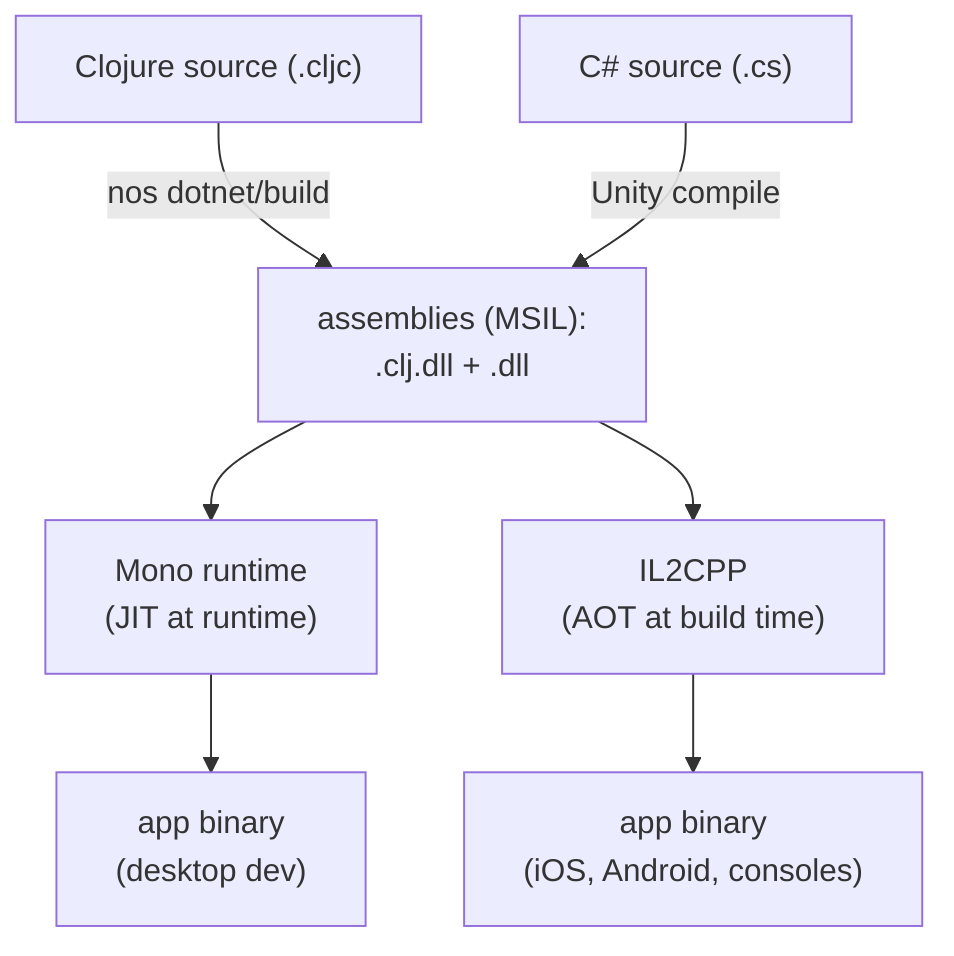

# Why MAGIC

MAGIC (Morgan And Grand Iron Clojure) is a Clojure compiler that targets the Common Language Runtime (.NET). It exists to satisfy one requirement the JVM Clojure compiler and the existing .NET port cannot meet together: running Clojure in Unity on platforms that forbid runtime code generation, notably iOS.

## The problem: AOT platforms forbid runtime codegen

There is already a Clojure-to-.NET compiler, [ClojureCLR](https://github.com/clojure/clojure-clr), David Miller's port. It runs well on desktop, but it cannot ship on iOS.

ClojureCLR leans on the DLR (Dynamic Language Runtime) for dynamic dispatch, and the DLR builds call sites by emitting IL at runtime through `System.Reflection.Emit`. That is a form of JIT (Just-In-Time) compilation: new executable code is produced while the program runs.

Two production constraints make that impossible on the platforms Unity games ship to:

- **iOS enforces W^X (Write XOR Execute).** A memory page is either writable or executable, never both, so an app may not generate and then run new machine code at runtime. Apple rejects apps that try.
- **IL2CPP is an ahead-of-time (AOT) compiler.** Unity's production scripting backend converts every .NET assembly to C++ at build time, then compiles that to native code. It can only translate IL that already exists in the assemblies. IL that a program intends to emit later, at runtime, is not there to translate.

So a compiler that defers any code generation to runtime cannot run under IL2CPP, and cannot ship on iOS.

## What MAGIC does differently

MAGIC produces fully static MSIL bytecode. Every function call, protocol dispatch, and dynamic call site is lowered to a static IL pattern at compile time. Nothing is emitted at runtime. The `.clj.dll` assemblies MAGIC writes contain all the IL the program will ever run, so IL2CPP can translate them to C++ ahead of time and the result satisfies W^X.

Emitting all IL statically also gives MAGIC direct control over the bytecode it produces, which helps where JVM and CLR semantics diverge (value types, generics). This is a different set of trade-offs from a DLR-based port, not a wholesale improvement: the DLR's runtime code generation buys flexibility, at the cost of the AOT compatibility MAGIC needs for iOS and IL2CPP.

## Where each backend runs

Unity has two scripting backends. The choice is per build target.

| Platform | Backend | Why |
|----------|---------|-----|
| Desktop (PC/Mac) | Mono JIT or IL2CPP | No restriction; Mono is used for fast iteration |
| Android | IL2CPP | 64-bit requirement; Mono has no ARM64 |
| iOS | IL2CPP | Apple forbids runtime JIT (W^X) |
| Consoles | IL2CPP | Similar AOT-only restrictions |

In practice IL2CPP is the production backend on every shipping platform; Mono JIT is only a desktop development convenience. MAGIC supports both.

## From source to device

The MSIL in a `.clj.dll` is not native code. Mono JIT-compiles it on the fly at runtime; IL2CPP transpiles it to C++ at build time. Because MAGIC's IL is fully static, both paths work. Before IL2CPP runs, `magic-unity` applies a Mono.Cecil pre-build step that adapts MAGIC's dispatch patterns for the AOT transpiler; see [magic-unity](../magic-unity/README.md) and [Unity integration](./unity-integration.md).

## See also

- [Writing cross-platform Clojure](./writing-cross-platform-clojure.md): the `.cljc` source patterns for code that runs on both the JVM and the CLR.
- [magic-compiler](../magic-compiler/README.md): how the compiler itself works (analyzer, compilers, spells), with the Arcadia-era history that motivated it.
- [Porting a Clojure library to MAGIC](./porting-libraries-to-magic.md) and [Unity integration](./unity-integration.md): the build and consume workflows.
