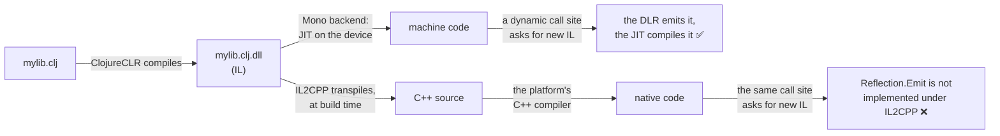
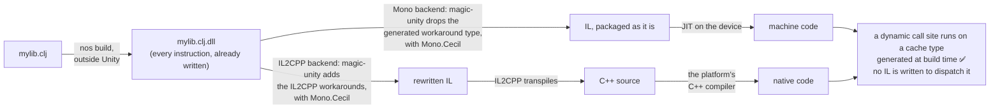
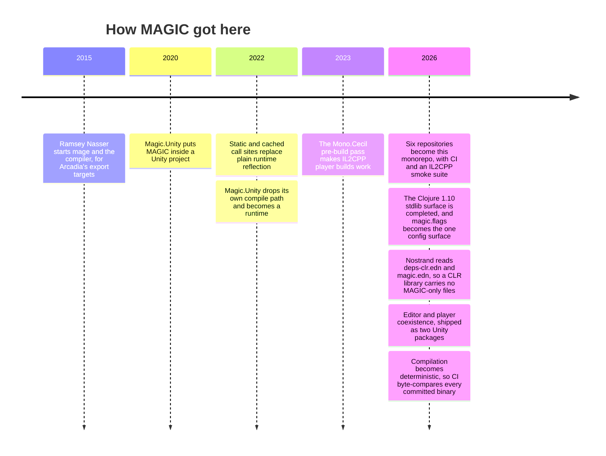

# Why MAGIC

Unity games ship to iOS, and iOS does not let a program write new executable code while it runs. The Clojure compiler for .NET does exactly that, at every dynamic call site. So we cannot use it to target iOS devices.

MAGIC (Morgan And Grand Iron Clojure) exists to close that gap. It is a [bootstrapped](./bootstrap.md) Clojure compiler that targets the Common Language Runtime (.NET) and writes every instruction ahead of time, so there is nothing left to generate once the app is on the device. This allows people to compile their Clojure libs for the CLR, call them in their Unity apps, and more importantly **build to iOS** (via IL2CPP).

## The problem: AOT platforms forbid runtime codegen

Clojure on .NET already existed before MAGIC, and it cannot ship on a phone.

That port is [ClojureCLR](https://github.com/clojure/clojure-clr), maintained by David Miller, and it runs well on the desktop. Its dynamic dispatch goes through the [DLR](https://learn.microsoft.com/en-us/dotnet/framework/reflection-and-codedom/dynamic-language-runtime-overview) (Dynamic Language Runtime), which builds each call site by emitting IL at runtime through `System.Reflection.Emit`. IL is the bytecode the .NET runtime executes, so this is a form of JIT (Just-In-Time) compilation: new executable code is produced while the program runs.

The problem is that iOS refuses to run code the app wrote for itself. iOS enforces **W^X** (Write XOR Execute): a memory page is either writable or executable, never both, so an app may not generate machine code and then run it. Apple rejects apps that try.

So a Unity game bound for iOS has always been compiled ahead of time, since long before IL2CPP existed: Mono's full-AOT mode did that job from 2008. Today [IL2CPP](https://docs.unity3d.com/6000.5/Documentation/Manual/scripting-backends-il2cpp.html), Unity's production scripting backend, is what does it. IL2CPP converts every .NET assembly to C++ at build time and compiles that to native code, so it can only translate IL that already exists in the assemblies. IL a program intends to emit later is not there to translate, and Unity says so plainly: an ahead-of-time (AOT) platform [cannot implement any of the methods](https://docs.unity3d.com/Manual/scripting-restrictions.html) in `System.Reflection.Emit`, so the call fails rather than doing nothing.

The diagram below follows the same code down both backends, and shows where the DLR stops working.

```mermaid
flowchart LR
    clj["mylib.clj"] -->|"ClojureCLR compiles"| dll["mylib.clj.dll<br/>(IL)"]

    dll -->|"Mono backend:<br/>JIT on the device"| mono["machine code"]
    mono -->|"a dynamic call site<br/>asks for new IL"| ok["the DLR emits it,<br/>the JIT compiles it ✅"]

    dll -->|"IL2CPP transpiles,<br/>at build time"| cpp["C++ source"]
    cpp -->|"the platform's<br/>C++ compiler"| nat["native code"]
    nat -->|"the same call site<br/>asks for new IL"| ko["Reflection.Emit is not<br/>implemented under IL2CPP ❌"]
```

That restriction now follows IL2CPP rather than the platform that first imposed it. An Android or desktop project picks IL2CPP for its own reasons and gives up runtime code generation as part of the deal, even though the OS there would have allowed it. So a compiler that defers any code generation to runtime cannot ship on iOS, and cannot run under IL2CPP anywhere.

## What MAGIC does differently

MAGIC writes all the IL at build time, so the device never has to.

Every function call, protocol dispatch, and dynamic call site is lowered to a static IL pattern at compile time. The `.clj.dll` assemblies MAGIC writes hold all the IL the program will ever run, so IL2CPP has everything it needs to translate them to C++, and W^X is never challenged. The diagram below is the same journey as the one above, this time compiled by MAGIC. Both backends now reach the end.

```mermaid
flowchart LR
    clj["mylib.clj"] -->|"nos build,<br/>outside Unity"| dll["mylib.clj.dll<br/>(every instruction, already written)"]

    dll -->|"Mono backend: magic-unity drops the<br/>generated workaround type,<br/>with Mono.Cecil"| mil["IL, packaged as it is"]
    mil -->|"JIT on the device"| mach["machine code"]

    dll -->|"IL2CPP backend: magic-unity adds<br/>the IL2CPP workarounds,<br/>with Mono.Cecil"| iil["rewritten IL"]
    iil -->|"IL2CPP transpiles"| cpp["C++ source"]
    cpp -->|"the platform's<br/>C++ compiler"| nat["native code"]

    mach --> site["a dynamic call site runs on a cache type<br/>generated at build time ✅<br/>no IL is written to dispatch it"]
    nat --> site
```

Emitting all IL statically also gives MAGIC direct control over the bytecode it produces, which helps where JVM and CLR semantics diverge, notably value types and generics. This is a different set of trade-offs from a DLR-based port, not a wholesale improvement: the DLR's runtime code generation buys flexibility, at the cost of the AOT compatibility MAGIC needs for iOS and IL2CPP.

The Mono.Cecil step in the diagram belongs to `magic-unity`, and [Unity integration](./unity-integration.md) covers it along with the rest of the Unity workflow.

## Where each backend runs

Unity has two scripting backends, and the choice is per build target.

| Platform | Backend | Why |
|----------|---------|-----|
| Desktop (PC/Mac) | Mono JIT or IL2CPP | No restriction; Mono is used for fast iteration |
| Android | IL2CPP | Google Play requires 64-bit and Unity's Mono backend has no ARM64 |
| iOS | IL2CPP | Apple forbids runtime JIT (W^X) |
| Consoles | IL2CPP | The console OS forbids runtime JIT (W^X), and Unity offers no other backend there |

The reasons differ. On Android, nothing about the operating system is stopping you.

Phones run ARM CPUs, and the current ARM instruction set is 64-bit: `arm64-v8a`, also called ARM64 or AArch64. A binary is compiled for one instruction set or the other, so an Android app that contains native code ships a separate one per architecture. Google Play will not publish an app with native code unless an ARM64 build is among them, and Unity's Mono backend only builds 32-bit ARM on Android. That leaves exactly one backend for a shippable Android player, IL2CPP, and IL2CPP means AOT. Android itself JIT-compiles code all day and would happily run a program that generates its own. It is a store policy plus a gap in Unity's toolchain that rules it out, not the platform.

iOS and the consoles are the other case. There the platform forbids runtime code generation outright, and no change of toolchain can help.

So every mobile and console build goes through IL2CPP, and the choice only stays open on desktop, where Mono is the usual pick for fast iteration. MAGIC supports both.

## Side by side with Clojure/JVM and ClojureCLR

Clojure has many implementations (ClojureScript, ClojureDart, babashka, ...), and MAGIC is measured against two of them: Clojure on the JVM, the reference, and ClojureCLR, the other Clojure on the CLR. If you know either, the table below places MAGIC against them. The "Compiler runs" row is where everything above comes from.

|                     | Clojure/JVM                  | ClojureCLR             | MAGIC                     |
|---------------------|------------------------------|------------------------|---------------------------|
| Runner              | `clj`                        | `cljr`                 | `nos`                     |
| Compiler lives in   | `clojure.jar`                | `Clojure.dll`          | `magic-compiler/` + `mage/` |
| Compiler written in | Java                         | C#                     | Clojure                   |
| Compiler runs       | while the program runs       | while the program runs | ahead of time, during `nos build` |
| Writes new code     | at run time, through ASM     | at run time, through the DLR and `Reflection.Emit` | at build time only, through `mage` and `Reflection.Emit` |
| Data runtime        | `clojure/lang/*.java`        | `clojure/lang/*.cs`    | `clojure-runtime/`        |
| Fast dispatch from  | HotSpot's JIT, for free      | the DLR                | `magic-runtime/`, by hand |
| Output unit         | `my/ns__init.class` in a jar | `my.ns.clj.dll`        | `my.ns.clj.dll`           |

The `clojure-runtime/` cell is not a rewrite: it is a fork of ClojureCLR's `clojure/lang/*.cs`, so the collections, keywords, vars and reader are the same code David Miller wrote. What the fork kept and dropped is in [the architecture](./architecture.md#the-runtime).

A compiler written in Clojure has to compile itself, which is why the compiler's own compiled output is committed, in [the bootstrap](./bootstrap.md).

## Where MAGIC came from

MAGIC is eleven years old, and it was built for this exact problem before anything shipped on it.

Ramsey Nasser started it in 2015 while working on [Arcadia](https://github.com/arcadia-unity/Arcadia), which put Clojure in the Unity editor on top of ClojureCLR. The blocker was the same one: ClojureCLR output did not survive Unity's export to its restricted targets, iOS among them. `mage` came first, in May 2015, and the compiler followed in July. Arcadia never switched over, so for years MAGIC was an alternative backend that worked and shipped nothing. That changed in 2021, when [Flybot](https://flybot.sg) needed Clojure game libraries running inside a shipping Unity game. Everything since is in the timeline below.

```mermaid
timeline
    title How MAGIC got here
    2015 : Ramsey Nasser starts mage and the compiler, for Arcadia's export targets
    2020 : Magic.Unity puts MAGIC inside a Unity project
    2022 : Static and cached call sites replace plain runtime reflection : Magic.Unity drops its own compile path and becomes a runtime
    2023 : The Mono.Cecil pre-build pass makes IL2CPP player builds work
    2026 : Six repositories become this monorepo, with CI and an IL2CPP smoke suite : The Clojure 1.10 stdlib surface is completed, and magic.flags becomes the one config surface : Nostrand reads deps-clr.edn and magic.edn, so a CLR library carries no MAGIC-only files : Editor and player coexistence, shipped as two Unity packages : Compilation becomes deterministic, so CI byte-compares every committed binary
```
